# Repertoire of the evaluation framework `eval.cli`

Written on 2026-09-29 from a reading of the code in `downscaling-tools` on `main`. The method descriptions and the line numbers were taken at commit `bf24cbe`. The same night the code was reorganised (up to commit `d46d457`): `eval/cli.py` became the package `eval/cli/` with new `list` and `describe` subcommands; the computation of each evaluator moved from `eval/_backends/<name>/` into `eval/evaluators/<name>/core/`, shared code into `eval/shared/`, and standalone tools into `eval/tools/` (see `ARCHITECTURE.md`); every figure now uses the house style of `eval/plotting/` and is written as PNG and PDF; and a bug in the precipitation evaluators on regional runs was fixed. File paths in this document have been updated to the new layout, but line numbers still refer to `bf24cbe` and may have moved by a few lines. What each tool computes did not change. The figures were drawn with the new style. For the current list of tools, run `python -m eval.cli list`; for one tool, `python -m eval.cli describe <name>`.

**Update of 2026-09-29, after this document was written.** The subcommand and evaluator called `membermaps` in the sections below were renamed `zoom_maps` (code in `eval/evaluators/zoom_maps/`). The subcommands `report` and `videogen` were retired: their sections below describe tools that no longer run, and `python -m eval.cli membermaps`, `report` and `videogen` now print where the tool went and exit with status 1 (`eval/cli/retired.py`, `eval/_quarantine/20260929/README.md`). Paths and commands in the text below still use the old names.

The purpose of this document is to let a scientist, and the AI agents that work for that scientist, decide which evaluation tool answers a given question, and whether each tool deserves to be kept. Each tool has its own section with the same layout. The sections contain recommendations, always marked as such. They are not decisions; the decisions are listed at the end as open questions.

A note on how the facts were gathered. The methods were read from the code, not inferred from tool names. The example values were read from real result files on `hpc-login` and each one quotes its path. Run times come from the SLURM accounting database (`sacct`) for jobs of August and September 2026 on the `o320_o1280` lane, and are labelled as measured. The "declared" resources are the walltimes requested in the lane files, which are ceilings and not measurements. Usage counts come from a bounded search of `/home/ecm5702/scratch/eval` (explained in the overview) and are lower bounds, because the scratch file system is cleaned automatically and older results have disappeared.

## 1. Introduction

### 1.1 What the framework is

The framework `eval.cli` evaluates diffusion models that downscale weather forecasts. A downscaling model takes a forecast on a coarse grid and produces a forecast on a finer grid, with several ensemble members. An ensemble is a set of forecasts of the same event, each started from slightly different conditions, so that the spread among the members represents forecast uncertainty. The command is `python -m eval.cli <subcommand>`, run from `/home/ecm5702/dev/downscaling-tools`. It has thirteen subcommands, a list of evaluators kept in one file (`eval/evaluators/registry.py`), and two front ends around it: `eval/jobs/ladder.py` for scoring a series of checkpoints against a fixed baseline, and `eval/jobs/pipeline.py` for generating chains of SLURM batch jobs. SLURM is the job scheduler of the supercomputer of the European Centre for Medium-Range Weather Forecasts (ECMWF).

### 1.2 The four lanes, and what "truth", "input" and "baseline" mean

A lane is one downscaling problem, defined by a YAML file (a plain-text configuration format) in `eval/config/lanes/`. There are four independent lanes. They are never chained together: the output of one is never the input of the next.

The table below uses ECMWF terms, explained here first. A grid named O followed by a number, such as O320, is an octahedral reduced Gaussian grid with that many latitude circles between the pole and the equator; O1280 is the grid of the operational high-resolution forecast. ENFO is the operational medium-range ensemble forecast (about fifteen days). EEFO is the operational extended-range ensemble forecast (weeks ahead). IEKM is the project's label for a deterministic, single-member, kilometre-scale simulation derived from the Destination Earth programme (in the keys of ECMWF's archive, MARS, it is expver `i4ql`). The streams of each lane are recorded in `eval/config/anemoi_inference_reference/O48.yaml`, `O1280.yaml` and the lane YAML files; the metadata embedded in the checkpoint is the final authority.


| Lane | Grid step of input to output | Input stream | Truth stream |
|---|---|---|---|
| `o48_o96` | about 240 km to 120 km | ENFO on grid O48 | IEKM on grid O96 |
| `o96_o320` | about 120 km to 36 km | EEFO on grid O96 | ENFO on grid O320 |
| `o320_o1280` | about 36 km to 9 km | EEFO on grid O320 | ENFO on grid O1280 |
| `o1280_o2560` | about 9 km to 4.5 km | ENFO on grid O1280 | IEKM on grid O2560 |

In this framework, **truth** means the field called `y` that is stored inside every prediction file. It is the lane's target field, cut from the same bundle that supplied the input. On the two ENFO lanes it is one ENFO member per model member. That member is a real forecast member, but it is not the realisation that the EEFO input describes: EEFO and ENFO are two different ensembles, and the pairing of member number k of one with member number k of the other is only a storage convention. The code says so in several places (for example `eval/evaluators/membermaps/core/plot_member_wind_maps.py`, docstring, and `eval/evaluators/tc_structure/runner.py`, docstring). Every tool that compares a model member with a truth member therefore compares distributions, not individual cases, unless the tool says otherwise.

**Input** means the coarse forecast that drives the model, stored as `x`, and its interpolation to the fine grid, stored as `x_interp`. Comparing the model with `x_interp` answers the question "what did the downscaling add?", because `x_interp` is what one gets with no downscaling at all.

**Baseline** is used with two different meanings in this codebase, and the reader must not confuse them. First, the lane baseline is the top-ranked run on the lane's scoreboard. It is stored in the scoreboard file `scoreboard_<lane>/scoreboard.json` under `meta.baseline`, and it is the reference for the option `--vs-baseline` (`eval/baseline.py:41`, `eval/baseline.py:112`). Second, in the precipitation tools "baseline" means the interpolated input (`x_interp`) or, for the o1280 to o2560 lane, the driving o1280 member interpolated by nearest neighbour. The overview and the sections say which meaning applies.

### 1.3 How a run flows

A run has four steps, and each step is also a subcommand.

The first step builds the inputs. The subcommand `prepare` builds "truth-aware bundles": one NetCDF file (a common file format for gridded scientific data) per date, lead time and member, holding the coarse input, the static fine-grid fields and the truth, all cut from source GRIB files (`eval/prepare/builder.py:42`). GRIB is the standard file format of weather fields. Alternatively, the `prepml` mode of `predict` runs inference with the ECMWF tool prepml, which publishes the ensemble to the FDB (the Fields DataBase, ECMWF's live field store) under a research experiment version (expver), and then retrieves it.

The second step is `predict`. It runs the checkpoint on the bundles, on a graphics processing unit (GPU), and writes one file per date and lead time named `predictions_<YYYYMMDD>_step<NNN>.nc` into `<run>/predictions/`. Each file holds `y_pred` (the model members), `y` (the truth), `x` and `x_interp` (the input), the coordinates `lat_hres` and `lon_hres`, and the list of `weather_state` names such as `2t` (2 m temperature), `10u` and `10v` (10 m wind components), `msl` (mean sea level pressure, MSLP), `t_850` and `z_500`. This file name convention is a contract: nearly every evaluator finds its input by matching it.

The third step is `evaluate`. It runs a list of evaluators over the prediction files. Each evaluator writes into its own directory `<run>/evaluators/<name>/`. When an evaluator finishes without error the framework writes a marker file `.complete` there, and a later run skips an evaluator that has a marker unless `--overwrite` is given (`eval/cli.py:1133`). The evaluators to run are chosen in three ways, in this order of priority: `--only a,b,c`; the option `--include-diagnostics`, which adds the lane's `diagnostics` group; otherwise the lane's `default` group (`eval/cli.py:574`).

The fourth step is `scoreboard`. For every evaluator that the registry marks as feeding the scoreboard, the aggregator calls the evaluator's `score()` function and writes `<run>/scoreboard/scores.csv` and `scores.md` (`eval/scoreboard/aggregator.py:18`, `eval/cli.py:1272`). With `--vs-baseline` it also writes `scoreboard/vs_baseline.md`, a table of differences against the lane baseline. Finally a "lean layout" step projects the evaluator directories into the run root as symbolic links: a combined `metrics.json`, `plots/<name>/`, `data/<name>/`, and promoted PDF files (`eval/lean_layout.py:151`). The command `run` performs predict, evaluate and scoreboard in sequence (`eval/cli.py:1456`).

The scoreboard that ranks runs across a lane (the file `scoreboard_<lane>/scoreboard.json` in the documentation hub, `/home/ecm5702/dev/docs/docs`) is not written by this repository. It ingests the `scores.csv` files through separate code in the documentation repository, which I did not read.

### 1.4 Where outputs land

A run directory is `/home/ecm5702/scratch/eval/<lane>/run_<timestamp>/` unless `--output-dir` is given (`eval/cli.py:632`). It contains `effective_config.json` (the fully resolved configuration, the command line and the git commit), `predictions/`, `evaluators/<name>/`, `scoreboard/`, `plots/`, `data/`, `metrics.json` and `evaluators/status.json` (a record of which evaluators ran, were skipped or failed). Ladder cards are written to `/home/ecm5702/perm/eval-ladders/<card_id>/ladder.json`, with run artifacts under `/home/ecm5702/scratch/eval/ladder/<card_id>/step_<N>/`. The scratch file system is cleaned automatically, so anything that must survive has to be copied to permanent storage.

### 1.5 Terms and abbreviations used in this document

| Term | Meaning |
|---|---|
| ECMWF | European Centre for Medium-Range Weather Forecasts |
| ENFO, EEFO, IEKM | Streams and labels defined in section 1.2 |
| OPER, AN | The operational high-resolution forecast system; its analysis (`type=an`) is the best estimate of the real atmosphere at a given time and appears in results as the row "OPER-AN" |
| MARS | ECMWF's permanent meteorological archive and its retrieval client |
| FDB | Fields DataBase, ECMWF's live store into which forecast jobs write |
| expver | Experiment version, the four-character key that names a set of fields in MARS and FDB |
| prepml | The ECMWF tool that runs the model over the ensemble and publishes to the FDB through an ecFlow workflow |
| ecFlow | ECMWF's workflow scheduler, which prepml uses to drive its steps |
| SLURM | The job scheduler of the ECMWF supercomputer |
| YAML | A plain-text configuration format; lanes, hosts and ladder profiles are YAML files |
| GRIB | The standard file format of weather fields, used by MARS and the FDB |
| NetCDF | A common file format for gridded scientific data; the format of the bundles and prediction files |
| eccodes | ECMWF's software library for reading and writing GRIB |
| MLflow | An experiment-tracking tool whose file store holds the logged training curves |
| L2 error | The Euclidean size of a difference between two curves, the square root of the sum of squares; "relative L2" divides it by the Euclidean size of the reference curve |
| SYNOP | Surface synoptic observations, the station reports that quaver uses as surface truth |
| HURDAT | The text format of the hurricane database of the United States National Hurricane Center, which tctracker imitates |
| quaver | ECMWF's verification tool, run through the `quaver` module; it stores scores in its own database |
| tctracker | ECMWF's tropical cyclone tracker, run through the `tctracker` module |
| gptosp | The ECMWF program that transforms a gridded field into spherical harmonic coefficients |
| TC | Tropical cyclone (hurricane or typhoon) |
| MSLP | Mean sea level pressure, the weather state `msl` |
| CRPS | Continuous Ranked Probability Score: for an ensemble forecast of a single number it measures how well the forecast distribution matches the observed value; lower is better, and for one member it equals the absolute error |
| fair CRPS | The CRPS corrected so that a small ensemble is not penalised for honest spread |
| RMSE | Root mean squared error |
| MSE, nMSE | Mean squared error, and mean squared error divided by the truth's variance (dimensionless) |
| HEALPix | Hierarchical Equal Area isoLatitude Pixelisation, a way of cutting the sphere into equal-area pixels; used here as a fast substitute for a true spherical transform |
| CPU, GPU | Central processing unit, graphics processing unit |
| AC, AG | The two partitions of the ECMWF Atos supercomputer: AC has CPUs and the full software stack (MARS, FDB, metview, gptosp, quaver); AG has GPU nodes on a different processor architecture without those tools |
| metview | ECMWF's meteorological toolkit, obtained with `module load ecmwf-toolbox` |
| FFT | Fast Fourier transform |
| PDF | Used here for probability density function; the file format is written "PDF file" |
| percentile p | The value below which p per cent of the sample lies; "the 0.01th percentile" is very close to the minimum |
| hPa | Hectopascal, the unit of pressure used for MSLP (100 Pa) |

### 1.6 How to read the recommendations

Each section ends with a paragraph called "Keep, merge or retire?". It is my recommendation, written for you to accept or reject. A tool with a strong recommendation appears in the final numbered list of open questions. The figure placeholders at the end of each section are lines for the agent who will add the figures later.


## 2. Overview table

The table has one row per tool: every subcommand, every live evaluator, and the two front ends. Retired evaluators are in section 4.

How the usage count was made. For evaluators, the count is the number of directories named `evaluators/<name>` found with `find . -maxdepth N -type d -path "*/evaluators/<name>"` (N from 5 to 8, under `timeout 120`) in `/home/ecm5702/scratch/eval`. It is a lower bound: scratch is cleaned automatically, results moved elsewhere are not seen, and one campaign often holds several arms. For subcommands the count is whatever trace the command leaves; the trace is named in the cell. The column "Cost" gives measured wall-clock time from `sacct` where I could tie a job name to the tool with confidence, and otherwise says "declared" (a requested ceiling) or "not measured".

| Tool | Kind | Group | The one question it answers | Feeds scoreboard | Typical cost | Uses found (lower bound) |
|---|---|---|---|---|---|---|
| `run` | subcommand | not applicable | Can one command take a checkpoint through predict, evaluate and scoreboard? | Yes, through the scoreboard step | GPU for predict, then the evaluators | At least 1,296 run directories hold an `effective_config.json`; the count is shared with `predict`, `evaluate` and `tctracker` |
| `predict` | subcommand | not applicable | What ensemble does this checkpoint produce for the lane's dates, leads and members? | No | GPU, declared 1 GPU and up to 12 h; `--mode prepml` needs AC and the FDB | Shared with `run` |
| `prepare` | subcommand | not applicable | Can the truth-aware input bundles be built from source GRIB files? | No | CPU only; not measured | Not countable |
| `evaluate` | subcommand | not applicable | Can the chosen evaluators be run on predictions that already exist? | Only through `scoreboard` | Depends on the evaluators | Shared with `run` |
| `scoreboard` | subcommand | not applicable | What are the scored numbers of this run, and how do they differ from the lane baseline? | It is the scoreboard writer | Seconds to minutes, CPU | 25 `scoreboard/scores.csv` files and 13 `vs_baseline.md` files |
| `report` | subcommand | not applicable | Can a run directory be shown as one HTML page? | No | Expected to be seconds, CPU; not measured | 0 `report.html` files |
| `prepml-cleanup` | subcommand | not applicable | Which expvers have I consumed, and can their FDB data be deleted through ecFlow? | No | Seconds, needs ecFlow | The ledger has 127 rows; 14 rows, covering 5 expvers, are marked cleaned |
| `videogen` | subcommand | not applicable | Can the predictions of one storm be rendered as an MP4 video? | No | CPU, not measured | 1 output directory (`video_o320_o1280_idalia_franklin_24h`) |
| `evolution` | subcommand | not applicable | How does a training run evolve against a reference run, the input and the target? | No | Seconds, CPU | Not countable; the dashboard calls it |
| `tctracker` | subcommand | not applicable | What cyclone tracks does the ECMWF tracker find in the ensemble published to the FDB? | No | CPU, AC only; not measured | 11 tracker run directories and 6 shared reference caches |
| `tccompare` | subcommand | not applicable | How do track statistics compare between the model, a control, the target and the input? | No | Minutes, CPU | 16 `tc_tracks_metrics.json` files |
| `membermaps` | subcommand | not applicable | What does one member look like next to the input and the truth, with a shared colour scale? | No | CPU, measured 11.5 min for one job | Shares the count of the evaluator |
| `config` | subcommand | not applicable | What configuration will a lane really use once its `base:` chain is merged? | No | Seconds, reads YAML only | Not countable |
| `ladder` | front end | not applicable | Is a training run improving, checkpoint by checkpoint, against a frozen baseline recipe? | No, it keeps its own cards | One GPU job per rung, declared walltime 2 to 4 h | 22 cards in `/home/ecm5702/perm/eval-ladders` |
| `pipeline` | front end | not applicable | Can a chain of SLURM jobs (predict, evaluators, scoreboard) be generated with dependencies? | It generates the scoreboard job | Generation takes seconds | 2 generated `submit_pipeline.sh` files |
| `tc` | evaluator | scored | How deep and how strong are the model's cyclones, as raw extremes next to the truth and the analysis? | Yes | Measured 51 min, 8 CPUs; AC (metview) for regridded mode | 117 |
| `surface` | evaluator | scored | How large is the pointwise error on surface variables, as a normalised, weighted total? | Yes | CPU; about 32 min together with `probabilistic` in the rescore jobs | 97 |
| `spectra_ecmwf_v2` | evaluator | scored | Does the model's power spectrum match the truth's at fine scales (wavenumber above 100)? | Yes | Measured 2 h 17 min on 16 CPUs for 5 dates; AC only | 42 |
| `precip_scores` | evaluator | scored | How accurate is six-hour precipitation, per member and for the ensemble mean, compared with interpolating the input? | Yes | CPU; not measured | 0 |
| `sigma_loss` | evaluator | scored | How large is the denoiser's training loss at each noise level, per variable? | Yes | GPU, declared 1 h | 0 |
| `region_plot` | evaluator | standard | What do input, model and truth look like side by side over the lane's fixed regions? | No | Measured 13 to 28 min, 8 CPUs | 49 |
| `probabilistic` | evaluator | standard | How good is the ensemble as a probabilistic forecast (CRPS, spread, ensemble-mean error)? | No | Measured 15 to 20 min on 256 CPUs | 128 |
| `texture` | evaluator | diagnostic | Does the fine-scale part of the model's fields have the truth's texture, statistically? | No | Measured 69 min for 25 files with 10 members | 49 |
| `wind_extremes` | evaluator | diagnostic | Is the strongest 10 m wind a coherent feature or isolated grid-scale noise? | No | Measured 7.5 min for 8 files | 10 |
| `displacement` | evaluator | diagnostic | Does the model move weather features away from where its input puts them? | No | Measured 7.7 min for 8 files | 10 |
| `spectra_coherence` | evaluator | diagnostic | At each scale, does the model have the right amplitude and is it in phase with the truth? | No | CPU; not measured | 6 |
| `membermaps` | evaluator | diagnostic | What do input, truth and one member look like on a map, as full fields and as high-pass views? | No | Measured 11.5 min for one job | 4 |
| `spread_proxy` | evaluator | diagnostic | Is the model ensemble's spread similar to the spread of the ENFO truth ensemble? | No | CPU; not measured | 4 |
| `precip_dist` | evaluator | diagnostic | Does the distribution of precipitation values match the truth's at each lead time? | No | CPU; not measured | 3 |
| `precip_events` | evaluator | diagnostic | What do model and truth look like at the heaviest precipitation events? | No | CPU; not measured | 4 |
| `local_global` | evaluator | diagnostic | Does a run on a local cut-out give the same answer as the run on the whole globe? | No | CPU; not measured | 0 |
| `lane_diagnostics` | evaluator | diagnostic | Which figures explain an already scored result on the o1280 to o2560 lane? | No | CPU; not measured | 0 |
| `mlflow` | evaluator | diagnostic | How did training and validation losses evolve for this checkpoint? | No | Not measured; may copy files from Jupiter | 2 |
| `quaver` | evaluator | diagnostic | How does the published ensemble score in ECMWF's quaver, against stations and analyses? | No; its `score()` returns nothing | Measured 3 h 18 min on 4 CPUs; AC and the FDB | 35 |
| `storm_maps` | evaluator | diagnostic | What does the deepest storm look like, and how does its regional spectrum compare in the 40 to 150 km band? | No | Measured 2 to 3 min, 8 CPUs | 63 |
| `shape` | evaluator | diagnostic | Are fine-scale 10 m wind structures shaped like the truth's? | No | Measured 35 to 45 min on 8 to 16 CPUs (jobs named `shape_*`) | 0 (earlier script runs are not counted) |
| `tc_structure` | evaluator | diagnostic | Does the model's cyclone have the truth's structure (centre, wind profile, radii, vorticity)? | No | CPU; not measured | 0 |

Three observations from the table. First, six of the 22 live evaluators have no result directory on scratch at all (`precip_scores`, `sigma_loss`, `local_global`, `lane_diagnostics`, `shape` and `tc_structure`), and another two have only two or three (`mlflow` and `precip_dist`). Second, two of the five "scored" evaluators (`precip_scores` and `sigma_loss`) have never produced a result that I could find, so the scoreboard's scored set is in practice `tc`, `surface` and `spectra_ecmwf_v2`. Third, `probabilistic` is labelled "standard", which the registry defines as "runs by default on a lane", yet none of the four canonical lanes lists it in its default group (section 5, item 3).

### 2.1 Which tool for which question

This table is a shortcut for choosing a tool. It gives the first tool to reach for, and then the ones that complement it. The reasoning is in the sections.

| If you want to know | First tool | Then |
|---|---|---|
| Does the model produce deep cyclones and strong winds? | `tc` | `tc_structure`, `tccompare` |
| Is the error at fine scales acceptable? | `spectra_ecmwf_v2` | `texture`, `spectra_coherence`, `storm_maps` |
| Is the pointwise error low? | `surface` | `probabilistic` |
| Is the ensemble well spread and skilful? | `quaver` (canonical) | `probabilistic`, `spread_proxy` |
| Did the run look sane on a map? | `region_plot` | `membermaps`, `storm_maps` |
| Is a training run improving? | `ladder` | `evolution`, `mlflow` |
| Does the model move features? | `displacement` | `wind_extremes` |
| How is precipitation? | `precip_scores` | `precip_dist`, `precip_events` |
| What are the month-scale cyclone counts? | `tctracker` then `tccompare` | `tc` |
| How does a run compare with the lane baseline? | `scoreboard --vs-baseline` | `evolution --ref baseline:<lane>` |


## 3. The tools, one section each

The sections are grouped as follows: 3.1 subcommands and front ends, 3.2 scored evaluators, 3.3 standard evaluators, 3.4 diagnostic evaluators. In each section, "Method" says what is computed; file references are `path:line` at commit `bf24cbe`.

All commands below are run from `/home/ecm5702/dev/downscaling-tools` on `hpc-login` after activating the environment of the chosen host file (`eval/config/hosts/`). The examples use the lane `o320_o1280` and the host `atos_ac`, which is the ordinary combination. Paths in angle brackets are for you to fill in.

## 3.1 Subcommands and front ends

### 3.1.1 `run`

**Question it answers.** Can one command take a checkpoint from prediction through evaluation to a scoreboard?

**Method.** `run` is a sequence, not a computation. It calls `cmd_predict`, then `_run_evaluators` for the evaluators chosen by `--only`, `--include-diagnostics` or the lane's default group, then `_run_scoreboard`, and finally writes the completion time into `effective_config.json` and projects the lean layout (`eval/cli.py:1456-1481`). The order matters for failures: an evaluator that raises does not stop the others, but at the end the framework raises one error listing every failed evaluator, and it also treats an evaluator that the lane declares but that produced no output as a failure (`eval/cli.py:1063`, the block that builds `failures`). An evaluator that needs a host it is not on is skipped with a warning, not failed (`eval/cli.py:1004`). When `--expver` is given, `quaver` is added automatically to the default and diagnostics paths (`eval/cli.py:537`). For lanes with a `tc` block, `run` and `evaluate` first check that a reference analysis is declared (`require_lane_analysis_reference`).

**Inputs and outputs.** Inputs: a lane, a host, a checkpoint, and either existing bundles (`--bundle-dir`) or source GRIB files (`--source-grib-root`). Outputs: the run directory of section 1.4.

**How to run it.**

```
python -m eval.cli run --lane o320_o1280 --host atos_ac \
    --checkpoint <path/to/checkpoint.ckpt> --bundle-dir <path/to/bundles> \
    --output-dir /home/ecm5702/scratch/eval/o320_o1280/run_test --vs-baseline
```

Use `--dry-run` first to print the resolved configuration as JSON without running anything.

**Cost and constraints.** The predict step needs a GPU; the lane files declare one GPU and up to twelve hours. The evaluators then run on the same allocation, so a long list of evaluators occupies a GPU while doing CPU work; the front end `pipeline` avoids that by splitting the steps into separate jobs.

**How to read the result.** A run is complete when `effective_config.json` contains `completion_timestamp_utc` and `scoreboard/scores.csv` exists. Read `evaluators/status.json` to see what ran.

**Overlaps.** `pipeline` generates the same steps as separate SLURM jobs. `ladder score` wraps predict and evaluate for one checkpoint of a series.

**Keep, merge or retire?** My recommendation is to keep it. It is the entry point that the project documentation names.

**Figure.**
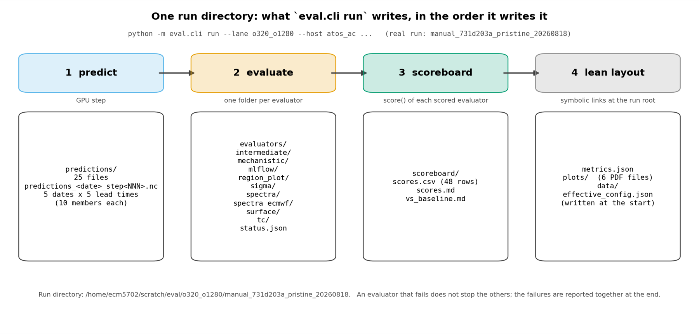
Figure caption: This diagram shows the four stages of one run and the real files that each stage leaves in the run directory. The example is a completed manual evaluation of the checkpoint at 400,000 training steps on the o320_o1280 lane, with 25 prediction files (five start dates from 26 to 30 August 2023, five lead times from 24 to 120 hours, ten ensemble members each), read from `/home/ecm5702/scratch/eval/o320_o1280/manual_731d203a_pristine_20260818`. Read it from left to right: only the first stage needs a graphics processing unit (GPU), and each later stage reads what the stage before it wrote. The evaluator folders named `sigma`, `mechanistic`, `intermediate` and `spectra` belong to an older version of the framework, which this run predates.

### 3.1.2 `predict`

**Question it answers.** What ensemble does this checkpoint produce for the dates, leads and members of the lane?

**Method.** Manual mode (the default) starts `python -m eval.predict.main` as a subprocess on the truth-aware bundles, passing the lane's sampler settings from `predict.sampler` as JSON, and wraps it in `srun` when `num_gpus_per_model` is greater than one and a SLURM job is active (`eval/cli.py:856-972`). If the checkpoint name begins with `inference-`, it is replaced by the base checkpoint of the same name because manual mode needs the base file (`eval/cli.py`, the block "Auto-resolve inference-* companion"). PrepML mode calls `eval.predict.prepml.prepml_predict`: it generates a prepml configuration, launches the workflow, retrieves the ensemble from the FDB and assembles the same `predictions_*.nc` files; it still needs truth-aware bundles to supply the truth. Inference is deterministically seeded (`eval/predict/seeding.py`, described in the comment above `PREDICT_SEED_DRAWS` in `eval/jobs/ladder.py`), so repeating a prediction gives the same field unless the seed is varied.

**Inputs and outputs.** Inputs: a checkpoint, bundles, and the lane's dates, steps (lead times in hours) and members. Output: `<output-dir>/predictions/predictions_<date>_step<NNN>.nc`, and in prepml mode a line in the ledger `~/.config/eval/prepml_consumed.jsonl` (`eval/predict/prepml.py:23`).

**How to run it.**

```
python -m eval.cli predict --lane o320_o1280 --host atos_ac --mode manual \
    --checkpoint <ckpt> --bundle-dir <bundles> --output-dir <run> \
    --dates 20230826,20230827 --steps 24,120 --members 1,2,3
```

PrepML mode adds `--mode prepml --expver <four-character-expver>` and needs AC.

**Cost and constraints.** The step needs a GPU. PrepML mode requires the AC partition (MARS, FDB and ecFlow exist only there) and writes to shared FDB state that only the service user can wipe.

**How to read the result.** The check is a file count: dates times steps files, each with the expected number of members. The manifest file `predictions_manifest.csv`, written by the prediction step (`eval/predict/main.py:298`), lists what was written; the project's evaluation rules ask to verify predictions exist before scoring, because re-staged twin directories can pass for results.

**Overlaps.** `run` and `ladder score` call it.

**Keep, merge or retire?** My recommendation is to keep it.

**Figure.**
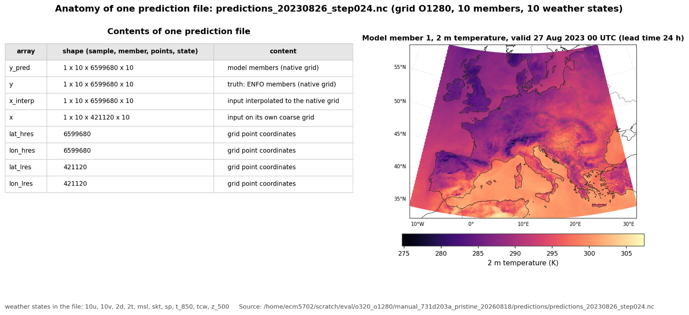
Figure caption: The table on the left lists the arrays stored in one prediction file and their shapes, and the map on the right draws one model member of 2 m temperature over Europe from the same file. The file is `predictions_20230826_step024.nc` in `/home/ecm5702/scratch/eval/o320_o1280/manual_731d203a_pristine_20260818/predictions/`: start date 26 August 2023, lead time 24 hours, ten members, ten weather states, on the native grid O1280 (an octahedral reduced Gaussian grid of about 9 km spacing). The array `y_pred` holds the model members, `y` the truth members (from ENFO, the operational ensemble forecast of the European Centre for Medium-Range Weather Forecasts, ECMWF), `x_interp` the coarse input interpolated to the fine grid, and `x` the input on its own coarse grid.

### 3.1.3 `prepare`

**Question it answers.** Can the truth-aware input bundles be built from source GRIB files?

**Method.** For every combination of date, step and member (or the listed `bundle_pairs`) it calls `manual_inference.prediction.predict build-bundle`, using the filename templates and channel lists of the lane's `prepare:` section (`eval/prepare/builder.py:42`). It is resumable, because a bundle that already exists is skipped, and it writes `bundle_build_verification.json` after checking that all expected bundles exist. It refuses to run inside a distributed job (`_assert_serial_prepare_context`, `eval/cli.py:766`).

**Inputs and outputs.** Input: a directory of source GRIB files. Output: NetCDF bundles named `<prefix>_date<YYYYMMDD>_time0000_mem<MM>_step<NNN>h_input_bundle.nc`, each holding the coarse input, the fine-grid constant fields and the truth.

**How to run it.**

```
python -m eval.cli prepare --lane o320_o1280 --host atos_ac \
    --source-grib-root <grib_dir> --bundle-dir <bundle_dir>
```

**Cost and constraints.** The step uses CPUs only, and I did not find a clean measurement of its run time. The lane must have a `prepare:` section, otherwise the command exits with a message.

**How to read the result.** There is no score. Open `bundle_build_verification.json` and check that no bundle is reported missing.

**Overlaps.** No other tool overlaps with it; it is a data preparation step.

**Keep, merge or retire?** My recommendation is to keep it.

**Figure.**
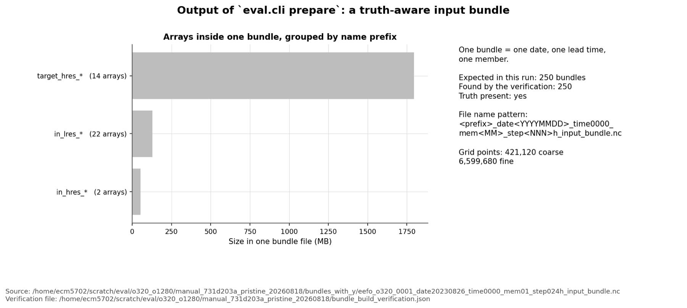
Figure caption: The bars show how much space each group of arrays takes inside one truth-aware input bundle: the coarse input (`in_lres_*`), the fixed fine-grid fields (`in_hres_*`) and the truth on the fine grid (`target_hres_*`), which is by far the largest part. The bundle is `eefo_o320_0001_date20230826_time0000_mem01_step024h_input_bundle.nc` in `/home/ecm5702/scratch/eval/o320_o1280/manual_731d203a_pristine_20260818/bundles_with_y/` (EEFO is the operational extended-range ensemble forecast of ECMWF). It is one of 250 bundles (five dates, five lead times, ten members), and the verification file of the same run confirms that all 250 exist; this step has no score, so that count is the result to check.

### 3.1.4 `evaluate`

**Question it answers.** Can the chosen evaluators be run on predictions that already exist?

**Method.** For each selected evaluator the framework resolves it in the registry, checks the host restriction and the `requires` list (an evaluator that requires a checkpoint is skipped when none is given), removes a stale results directory that lacks the `.complete` marker, calls `run()`, then `score()` if it exists (writing `metrics.json`), then `plot()`, and only then writes `.complete` and a status entry (`eval/cli.py:1063-1250`). The option `--plot-only` skips `run()` and `score()` and re-renders plots into an existing results directory. The option `--stages` passes a list of stage names to every evaluator, which only `lane_diagnostics` uses. Naming a retired evaluator with `--only` prints its replacement and exits with status 1 (`eval/cli.py:574`).

**Inputs and outputs.** Input: a predictions directory. Output: `<run>/evaluators/<name>/` for each evaluator, `effective_config.json`, and the lean layout at the run root. By default the output goes to the parent of the predictions directory.

**How to run it.**

```
python -m eval.cli evaluate --lane o320_o1280 --host atos_ac \
    --predictions-dir <run>/predictions --only tc,surface --run-label myrun
```

**Cost and constraints.** The cost is the sum of the costs of the chosen evaluators, which sections 3.2 to 3.4 describe one by one.

**How to read the result.** Read `evaluators/status.json` first, then each evaluator's `metrics.json`.

**Overlaps.** `run` includes it; `pipeline` splits it into one job per evaluator.

**Keep, merge or retire?** My recommendation is to keep it.

**Figure.**
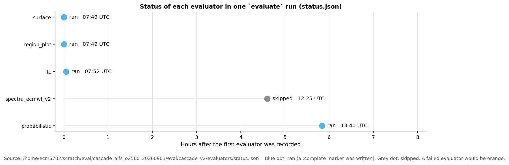
Figure caption: Each dot is one evaluator listed in the file `evaluators/status.json` that the `evaluate` step writes, placed at the time it was recorded. A blue dot means the evaluator ran and left a completion marker, and a grey dot means it was skipped. The example is the evaluation in `/home/ecm5702/scratch/eval/cascade_aifs_o2560_20260903/eval/cascade_v2/` (3 September 2026), where four evaluators ran and `spectra_ecmwf_v2` was skipped; reading this file first tells you which evaluators produced results before you open their folders.

### 3.1.5 `scoreboard`

**Question it answers.** What are the scored numbers of this run, and how do they compare with the lane baseline?

**Method.** The aggregator loops over the evaluators that the registry marks as feeding the scoreboard, imports each, calls its `score(results_dir, lane_config, eval_config)`, and collects the returned records `{metric, value, unit}` sorted by evaluator and metric (`eval/scoreboard/aggregator.py:18`). An evaluator whose `score()` raises is skipped with a warning, so its rows silently vanish; only when no evaluator gives any row does the command fail. The formatter writes `scores.csv` (full float precision) and `scores.md` (`eval/scoreboard/formatter.py`). With `--vs-baseline`, `write_vs_baseline` (`eval/baseline.py:112`) resolves the lane baseline from the documentation hub and writes a table of run minus baseline for the weighted surface nMSE, four surface variables (10v, 2t, msl, sp), the spectra mean score, and the raw TC extremes; it prints a verdict (better or worse) for the surface and spectra rows and gives no verdict for the TC rows.

**Inputs and outputs.** Input: a run directory whose `evaluators/` were produced by `evaluate`. Output: `scoreboard/scores.csv`, `scoreboard/scores.md`, and optionally `scoreboard/vs_baseline.md`.

**How to run it.**

```
python -m eval.cli scoreboard --lane o320_o1280 --eval-dir <run> --vs-baseline
```

**Cost and constraints.** It takes seconds on a CPU. `--vs-baseline` needs the scoreboard hub (`/home/ecm5702/dev/docs/docs`, or `DS_SCOREBOARD_HUB`) and a promoted baseline for the lane, otherwise it warns and skips.

**How to read the result.** Read the `vs_baseline.md` deltas, not the bare numbers, as the project's evaluation rules state. Only `tc`, `surface`, `spectra_ecmwf_v2`, `precip_scores` and `sigma_loss` can contribute rows.

**Overlaps.** No other tool overlaps with it. It is separate from the lane scoreboard of the documentation hub, which ranks runs and is written elsewhere.

**Keep, merge or retire?** My recommendation is to keep it. One small improvement to consider: make a failing `score()` visible in the summary instead of only in the log.

**Figure.**
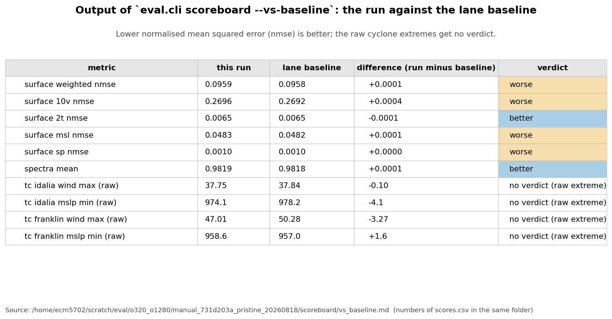
Figure caption: This table is the file `scoreboard/vs_baseline.md` written by `scoreboard --vs-baseline`, redrawn as a figure: for each metric it gives the run's value, the value of the lane baseline and their difference. Blue cells mean the run is better than the baseline and orange cells mean it is worse, and the tropical cyclone rows are raw extremes that receive no verdict. The run is the manual evaluation `/home/ecm5702/scratch/eval/o320_o1280/manual_731d203a_pristine_20260818` (18 August 2026), and the baseline is the one named in that file (the rebaseline checkpoint at step 397,434); the differences in normalised mean squared error (nmse) are at most 0.0004, so this run is practically equal to the baseline.

### 3.1.6 `report`

**Question it answers.** Can a run directory be presented as one self-contained HTML page?

**Method.** `generate_report` collects PDF files from `plots/` (falling back to the evaluator directories), names a tab for each by its file name, reads the metrics from `data/scoreboard/scores.csv` (the lean run layout; a run in the older layout therefore shows no metrics) or `metrics.json`, reads the run's identity from `effective_config.json`, and writes `report.html` plus a `report_assets/` folder of copied PDFs (`eval/report/__init__.py:262`).

**Inputs and outputs.** Input: a run directory. Output: `report.html` and `report_assets/`.

**How to run it.**

```
python -m eval.cli report --run-dir <run> --output <run>/report.html
```

**Cost and constraints.** It takes seconds on a CPU.

**How to read the result.** It is a viewer; it computes nothing.

**Overlaps.** The lean layout already puts the same PDFs and metrics at the run root; the scoreboard files hold the numbers.

**Keep, merge or retire?** My recommendation is to retire it, unless you use it. I found no `report.html` anywhere under scratch (bounded search), and the code has not changed since 1 July 2026 apart from the 28 September sweep.

**Figure.**
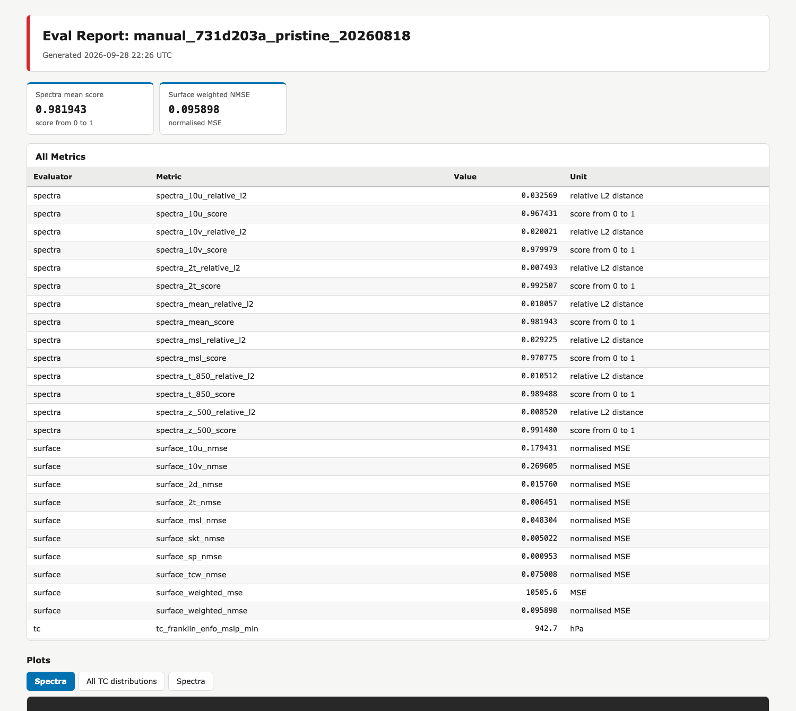
Figure caption: This is the top of the HTML page made by `eval.cli report`: a header, cards with the headline metrics, and the table of all metrics; below the visible part a row of tabs shows each PDF figure of the run, but a PDF is not drawn in this browser screenshot. The page was generated from a folder rebuilt from the run `/home/ecm5702/scratch/eval/o320_o1280/manual_731d203a_pristine_20260818`, with its `scores.csv` placed at `data/scoreboard/scores.csv` and three of its PDF files placed in `plots/` (folder `/home/ecm5702/scratch/eval/_repertoire_gallery_20260929/report_run_named/manual_731d203a_pristine_20260818`). The command reads that layout, which this older run does not have: run on the original folder it found six PDF files and no metrics.

### 3.1.7 `prepml-cleanup`

**Question it answers.** Which prepml experiments have I consumed, and can their FDB data be deleted through ecFlow?

**Method.** It reads the ledger `~/.config/eval/prepml_consumed.jsonl`, optionally asks ecFlow for the state of each expver, and force-runs the ecFlow tasks `run/delete/<task>` for the chosen expvers. The default scope `fdb` runs only `fdb`; the scope `all` runs `quaver`, `s3`, `mars`, `fdb` and `workdir`. The catalogue task is never run (`eval/predict/prepml_cleanup.py:38-39`). It asks for confirmation unless `--yes` is given, and `--dry-run` prints the ecFlow commands without running them.

**Inputs and outputs.** Input: the ledger and a reachable ecFlow server (`ecflow-gen-mlx-001`, port 3141). Output: deletions in the FDB, and an update of the ledger field `cleaned_ts_utc` (held in the code as `cleaned_utc`).

**How to run it.**

```
python -m eval.cli prepml-cleanup --list
python -m eval.cli prepml-cleanup --expver <expver> --scope fdb --dry-run
```

**Cost and constraints.** It takes seconds. It is destructive: it deletes shared FDB data. The project skill `ecmwf-infra-reference` states the hygiene rule as "clean with `prepml housekeeping --cleanup-expver`, never a manual FDB wipe"; this subcommand uses a different mechanism (ecFlow tasks), which the skill does not mention.

**How to read the result.** `--list` shows the ledger with the ecFlow state. Of the 127 ledger rows, 14 have a `cleaned_ts_utc` value; they cover the 5 expvers j5d7, j714, j74s, j75n and jb9u.

**Overlaps.** The prepml command `housekeeping` named in the skill.

**Keep, merge or retire?** My recommendation is to keep the function but to consider moving it out of `eval.cli`, because it is not an evaluation tool. Ask the owner whether the ecFlow route or `prepml housekeeping` is the sanctioned one.

**Figure.**
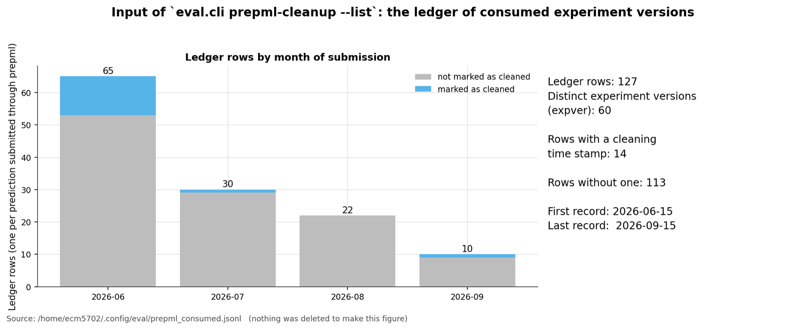
Figure caption: The bars count the rows of the ledger file `/home/ecm5702/.config/eval/prepml_consumed.jsonl` by month, where the ledger records every prediction submitted through prepml (the ECMWF tool that runs a model and publishes the forecasts to the FDB, the Fields Database); the blue part marks rows that carry a cleaning time stamp. The ledger holds 127 rows for 60 distinct experiment versions, from 15 June to 15 September 2026, and 14 rows (five experiment versions) carry a cleaning time stamp, which differs from the statement in the text above that none is marked cleaned. Nothing was deleted to make this figure.

### 3.1.8 `videogen`

**Question it answers.** Can the predictions of one storm be rendered as an MP4 video?

**Method.** A scene (`SceneConfig`, `eval/tools/videogen/config.py`) names a predictions directory, initial dates, steps, a background box, an inset that either is fixed or follows the minimum of MSLP inside a search box, the variables (`msl`, `wind`) and a layout (`single_inset` or `dual_row`). The pipeline computes colour limits with a cache, renders one PNG frame per valid time, and calls `ffmpeg` (module `ffmpeg/7.1.1`) to encode the MP4. Three scenes exist: `franklin_dual`, `franklin` and `himalayas` (`eval/tools/videogen/scenes.py:79`); their default predictions directory is a manual evaluation of the checkpoint `2241ade8` from May 2026, and the dates are 26 to 30 August 2023.

**Inputs and outputs.** Input: a predictions directory (overridable). Output: frames and an MP4 in the scene's output directory.

**How to run it.**

```
python -m eval.cli videogen --scene franklin_dual --mode preview --preview-valid 2023-08-29
python -m eval.cli videogen --scene franklin_dual --mode all --predictions-dir <predictions>
```

**Cost and constraints.** It runs on CPUs, I did not measure its run time, and it needs the `ffmpeg` module on the host.

**How to read the result.** It is a presentation tool; it computes nothing.

**Overlaps.** `membermaps` and `region_plot` draw single frames.

**Keep, merge or retire?** My recommendation is to retire it from `eval.cli`, or to move it to a presentation folder. Its scenes are hard-coded to one old checkpoint, only one output directory exists, and the code has not been touched since July apart from the 28 September sweep.

**Figure.**
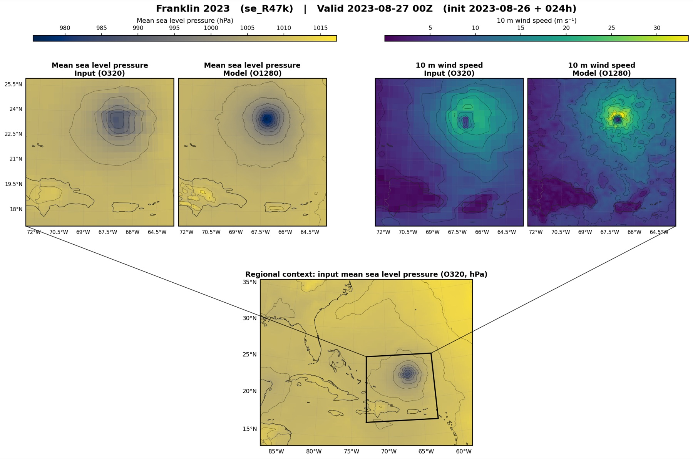
Figure caption: This is one preview frame made by the video tool: the coarse input and the model, at their own resolutions, over a box around Hurricane Franklin, with pressure (mean sea level pressure, MSLP) on the left and 10 m wind speed on the right, and a regional map of the input that shows where the box lies. It uses the file `/home/ecm5702/scratch/eval/o320_o1280/se_R47k_idalia/predictions/predictions_20230826_step024.nc` (start 26 August 2023, lead time 24 hours, valid 27 August 2023 at 00 UTC, checkpoint label se_R47k), with the box and the title set by hand for this preview instead of the built-in scene, which points to a checkpoint from May. The colour bars now sit above the panels, so the two lines that join the box to its outer panels cross nothing (in the earlier layout they ran across the colour bars). For this redraw the box was set to 17 to 26 degrees north and 73 to 63 degrees west, and the regional map to 12 to 37 degrees north and 92 to 54 degrees west, with the code at commit d46d457 of the branch style/figure-polish-20260929.

### 3.1.9 `evolution`

**Question it answers.** How is a training run evolving, compared with a reference run, the input and the target?

**Method.** It draws a grid: one row per weather state (`10u`, `10v`, `2t`, `tp` by default), one column per metric family, and one curve per experiment. The experiment curves come from ladder cards (`ladder.json`), the reference run is drawn as a dashed curve, and the input and the target, which do not train, are drawn as flat lines (`eval/jobs/evolution.py:80` for the column registry, `:150` for `render`). The metric families are the ensemble-mean RMSE, the spectra relative L2 error of `spectra_ecmwf_v2`, spread, fair CRPS and CRPS. The three references are required, and the figure refuses to overlay cards scored on different lanes, dates, leads or members unless `--allow-mixed-support` is given, in which case it stamps a warning on the figure. `baseline:<lane>` as a reference resolves to the archived ladder card of the lane baseline (`eval/baseline.py`).

**Inputs and outputs.** Input: ladder cards, plus two flat JSON files for the input and target anchors (made by `eval/jobs/ladder_references.py`, which is a separate script and not reachable through `eval.cli`). Output: one figure.

**How to run it.**

```
python -m eval.cli evolution \
    --exp mine=/home/ecm5702/perm/eval-ladders/<card_id>/ladder.json \
    --ref baseline:o96_o320 --input EEFO=<input.json> --target ENFO=<target.json> \
    --columns rmse,spectra --out <figure.png>
```

**Cost and constraints.** It takes seconds on a CPU.

**How to read the result.** The point of the anchors is scale: in the source's own words, on o96 to o320 the wind RMSE panels look like steady improvement until the anchors show that the whole span is 3.5 per cent wide.

**Overlaps.** `ladder plot` draws the card's own curves; `evolution` is the comparison version.

**Keep, merge or retire?** My recommendation is to keep it. It enforces the same-support rule that most past mistakes violated. It could be merged into `ladder` as a subcommand, since it only reads ladder cards.

**Figure.**
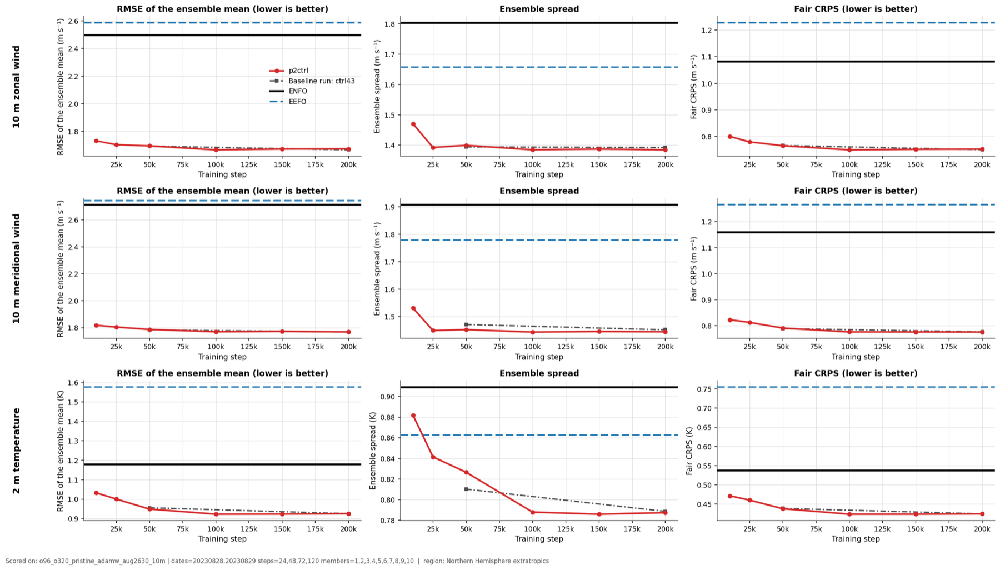
Figure caption: Each row is a weather state (10 m zonal wind, 10 m meridional wind, 2 m temperature) and each column a score for the Northern Hemisphere extratropics against training step: the root mean squared error (RMSE) of the ensemble mean, the ensemble spread, and the fair Continuous Ranked Probability Score (fair CRPS). The red curve is the training run `p2ctrl`, the dash-dot grey curve is the reference run `ctrl43`, and the flat lines are the input (EEFO, blue dashed) and the target (ENFO, black); lower is better for RMSE and CRPS, and for spread the target line is the goal. It was made with `eval.cli evolution` from the ladder cards `/home/ecm5702/perm/eval-ladders/p2ctrl_o96_o320/ladder.json` and `/home/ecm5702/perm/eval-ladders/ctrlseed43_o96_o320/ladder.json` and the anchors in `/home/ecm5702/scratch/eval/ladder/soap200k_o96_o320/_references/`, all scored on the same support (28 and 29 August 2023, lead times 24 to 120 hours, ten members, lane o96_o320); the spectral column was left out because it is not available on this lane.

### 3.1.10 `tctracker`

**Question it answers.** What cyclone tracks does the ECMWF tropical cyclone tracker find in the ensemble that a run published to the FDB, and in the references?

**Method.** For every initial date and member it runs the external program `tctracker` (module `tctracker`) on the fields of one FDB expver, with the flags `-v` (vorticity), `-r` (output grid), `-C/-T/-S` (class, type, stream), `-E` (expver), `-N` (member), `-d` (date), `-s/-f/-i` (first step, last step, step interval) and `-o` (output tar) (`eval/evaluators/tctracks/core/pipeline.py:160`). Each tar holds one text file per basin, in the HURDAT format (see the glossary), for the basins `atl`, `enp`, `cnp`, `wnp`, `nin`, `sin`, `aus` and `spc`. The framework then verifies each tar (contents, sha256, status manifest) and parses the tracks into tidy tables (`eval/evaluators/tctracks/core/parsing.py`). With `--track-sources model,ctrl=<expver>,target,input` the same settings also run over a control expver, the operational ENFO ("target") and the operational EEFO ("input"), so that every track set shares one tracking support; the reference tars are cached once under `/home/ecm5702/scratch/eval/tcrefs/` and reused (six reference sets exist there now). `--months 202509` expands to daily dates. For expvers of class `rd` it first checks that the FDB holds complete data per date and member, and skips incomplete dates unless `--track-incomplete` is given.

**Inputs and outputs.** Input: an expver already in the FDB. Output under `<scratch>/eval/<lane_short>/tctracker/<expver>/`: `tars/`, `logs/`, `manifests/`, and `parsed/` tables (`tracks`, `track_summary`, `forecasts`, `provenance.json`).

**How to run it.**

```
python -m eval.cli tctracker --lane o320_o1280 --host atos_ac --expver <expver> \
    --months 202509 --track-sources model,ctrl=<control_expver>,target,input
```

`--verify-only` and `--parse-only` re-check or re-parse existing tars, and `--slurm-script <path>` writes a resumable batch script instead of running.

**Cost and constraints.** It runs on AC only, because it needs `module load tctracker` and FDB access. It consists of many small jobs, one per date and member, and I did not measure it.

**How to read the result.** The tracker output is raw material; the statistics are made by `tccompare`. The tracks carry a classification code (the parser accepts `HR` followed by a digit, `TS`, `TD`, `ET` and `SSD`, which I read as hurricane category, tropical storm, tropical depression, extratropical and subtropical depression). Longitudes are degrees east from 0 to 360; southern-hemisphere basins are stored with a positive latitude and negated by the parser, and the code comments say this has not been validated against a southern-hemisphere storm (`eval/evaluators/tctracks/core/parsing.py:10-14`).

**Overlaps.** `tc` measures raw extremes on a box; `tctracker` follows individual storms through time and works only on data in the FDB. `tc_structure` measures the structure of one storm in the prediction files.

**Keep, merge or retire?** My recommendation is to keep it as a pair with `tccompare`, because it is the only month-scale, track-based view and 11 tracker runs exist. The project rules say the pair is a diagnostic panel and never a verdict source.

**Figure.**
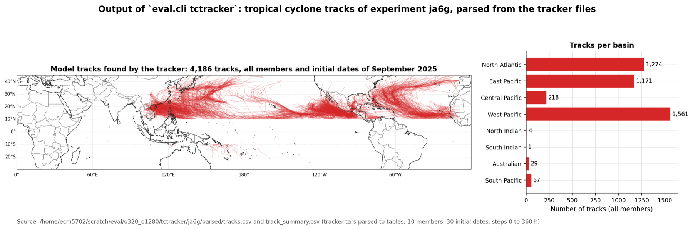
Figure caption: Each thin red line is one tropical cyclone track that the tracker found in one member of the model ensemble (experiment ja6g), and the bars count the tracks in each ocean basin. The data are the parsed tables `/home/ecm5702/scratch/eval/o320_o1280/tctracker/ja6g/parsed/tracks.csv` and `track_summary.csv`: 4,315 tracks in the summary table (4,186 of them have two or more points and are drawn) from 30 initial dates in September 2025, ten members and lead times up to 360 hours. This is what the tracker step leaves behind; comparing it with the operational ensemble is the job of `tccompare`.

### 3.1.11 `tccompare`

**Question it answers.** How do the track statistics of the model, a control, the target and the input compare over a month?

**Method.** It loads the parsed track tables of each source, checks that they share one tracking support (grid, steps, vorticity and cycle time) and only warns when they do not (`eval/evaluators/tctracks/scorer.py:62`), then computes for each scope (each month and the whole period), basin and role: the number of forecasts and tracks, tracks per forecast (with a bootstrap interval that resamples initial dates), the minimum, 5th percentile and median of each track's lowest MSLP, the maximum, 95th percentile and median of each track's peak wind, counts by classification, the number of "cyclone days" (track records with wind at or above 17.5 m/s), and the median and 10th and 90th percentiles of MSLP per lead step (`eval/evaluators/tctracks/scorer.py:138`). Counts are divided by the number of forecasts present so that sources with different completeness stay comparable. It also builds two-degree track density grids and picks the deepest few target tracks as "cases", associating the other sources' tracks by proximity of their deepest point in space (5 degrees) and time (48 hours) (`:233`). The comparison is distributional: no member is paired with another, because EEFO and ENFO are not paired. The figure suite is track maps, density differences against the target, intensity distributions with ratios, counts, step intensity and case pages (`eval/evaluators/tctracks/plotter.py`).

**Inputs and outputs.** Input: tracker run roots, named by `--sources` (an expver such as `model=j9f3`, a reference such as `target=od:enfo:0001`, or an absolute path). Output: `<scratch>/eval/<lane_short>/tctracks/<label>/tc_tracks_metrics.json` and the figures.

**How to run it.**

```
python -m eval.cli tccompare --lane o320_o1280 --host atos_ac \
    --sources model=<expver>,ctrl=<control_expver>,target=od:enfo:0001,input=od:eefo:0001 \
    --months 202509 --dates <pinned dates> --basins atl
```

Pin `--dates` to the dates that all sources have completely; otherwise different weather enters the comparison.

**Cost and constraints.** It takes minutes on a CPU. `--no-plots` gives metrics only and `--plot-only` re-renders from cached tables.

**How to read the result.** Compare the model's tracks per forecast, its median lowest pressure and its intensity distribution with the target's, not with the input's; a model that matches the target's counts and its deep tail is doing its job. Sixteen metric files exist under scratch.

**Overlaps.** `tc` on the same event gives raw extremes on a fixed box; the pair here gives storm counts and lifetime intensities.

**Keep, merge or retire?** My recommendation is to keep it together with `tctracker`. Consider merging the two subcommands into one that runs the tracker and then compares.

**Figure.**
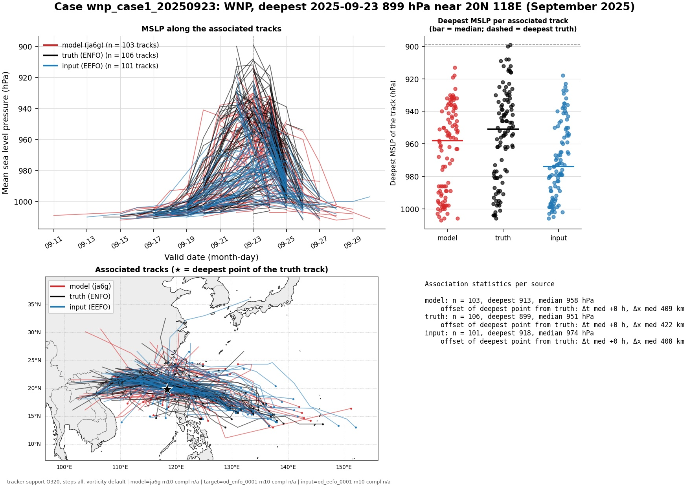
Figure caption: This is a case page of `tccompare`: the deepest West Pacific cyclone of 23 September 2025 (truth minimum 899 hPa near 20 degrees north, 118 degrees east), with mean sea level pressure along every associated track of the model (red), of ENFO as truth (black) and of the input EEFO (blue), the deepest value of each track, and all tracks on a map. It comes from the comparison `/home/ecm5702/scratch/eval/o320_o1280/tctracks/sept2025_ja6g_allbasins` (model ja6g, September 2025), redrawn with the current code into `/home/ecm5702/scratch/eval/_repertoire_gallery_20260929/tctracks/figures/`. The median deepest pressure of the model (958 hPa) lies between that of the input (974 hPa) and that of the truth (951 hPa), so the model deepens storms more than the input does but not as much as ENFO.

### 3.1.12 `membermaps` (subcommand and evaluator)

**Question it answers.** What do the driving input, the truth and a model member look like on a map, as full fields and as high-pass views that show only the fine-scale detail?

**Method.** Both entry points call the same backend (`eval/evaluators/membermaps/core/plot_member_wind_maps.py`). For each variable (10 m wind speed `wind10m`, `msl`, `2t`, `t_850`, `z_500`) it cuts a region from the O1280 points, resamples by nearest neighbour to a regular mesh (0.08 degree for the fine grid, 0.28 degree for the coarse), and draws one PNG per panel with a shared colour scale and projection. The option `--field fine` shows the field minus a Gaussian smoothing with a scale of `--fine-cut-deg` (default 0.6 degree): the filter is chosen so that the high-pass passes 99 per cent of a wavelength of 0.6 degree and 50 per cent at 1.6 degrees, so it keeps roughly what the O320 input could not carry (the code comment says the leakage biases a truth-versus-model contrast towards agreement) (`plot_member_wind_maps.py:51-57`, `:344-351`). The truth panel is the stored member of `y`, labelled "Operational ENFO". Nothing is scored.

The subcommand takes everything on the command line, including several `--run key=<predictions_dir>` arms for comparing arms of a campaign, `--grib key=<file>` panels for steps that are absent from the predictions, and `--no-truth` / `--no-input`. The evaluator (`eval/evaluators/membermaps/runner.py:59`) takes one predictions directory and renders every region of the lane (falling back to the `texture` regions) for the configured variables, both fields, dates, steps and members, refusing more than 120 renders (`:31`). The evaluator always uses the stored `y` as truth panel, whereas the subcommand can omit it, which the lane file `o320_o1280_aifs_crps_to_analysis.yaml` explains is needed when the stored `y` is not the intended truth.

**Inputs and outputs.** Input: prediction files. Output: PNG panels and a manifest JSON per render.

**How to run it.**

```
python -m eval.cli membermaps --run mine=<predictions_dir> --date 20230829 --step 72 \
    --member 1 --variable wind10m --field fine --output-dir <out>
python -m eval.cli evaluate --lane o320_o1280 --predictions-dir <run>/predictions --only membermaps
```

**Cost and constraints.** It runs on CPUs. Each render opens a multi-gigabyte prediction file; one job took 11.5 minutes.

**How to read the result.** Judge shape and placement of the fine-scale features by eye. The mid-lead step (72 hours) is the default because the shortest lead is the easiest case and the longest is where input and truth have drifted furthest apart.

**Overlaps.** `region_plot` draws six panels for the first file only; `storm_maps` zooms on the deepest storm; `precip_events` centres on precipitation maxima; `tc` writes per-member TC maps of its own.

**Keep, merge or retire?** My recommendation is to keep one of the two entry points as the primary, and let the other call it. The subcommand is the more general, so the evaluator could become a thin loop over it.

**Figure.**
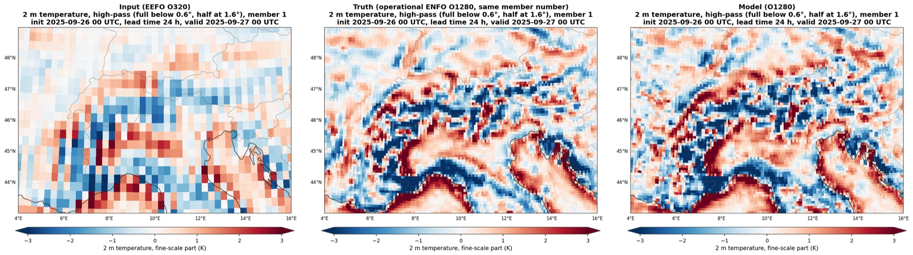
Figure caption: These are three maps of the fine-scale part of 2 m temperature (the field left after a high-pass filter removes the smooth large scales) over the Alps, on one colour scale: the coarse input (EEFO on the grid O320), the truth (member 1 of ENFO on O1280) and member 1 of the model, for the start of 26 September 2025 and lead time 24 hours. The three files are separate outputs of the tool, named `eefo_`, `enfo_` and `model_2t-fine_init20250926_n001_alps_f024.png`; they come from `/home/ecm5702/scratch/eval/o320_o1280/se_F/predictions`, were re-rendered into `/home/ecm5702/scratch/eval/_repertoire_gallery_20260929/membermaps/alps/` and were placed side by side for this document. Member 1 of ENFO is not the weather that member 1 of the model reproduces, so compare the amount and shape of the fine detail and not individual features.

### 3.1.13 `config`

**Question it answers.** What configuration will a lane actually use, after its chain of `base:` files is merged?

**Method.** It loads the lane exactly as every other subcommand does (`eval.config.loader.load_lane`), and prints the merged result as YAML or JSON. With `--sampler` it prints only `predict.sampler`, and with `--samplers` it prints the sampler of the four canonical lanes side by side and lists which keys differ (`eval/cli.py:1579`). Loader warnings, for example a sampler block that silently drops keys of its base, go to standard error.

**Inputs and outputs.** Input: a lane name. Output: text on standard output.

**How to run it.**

```
python -m eval.cli config o320_o1280 --sampler
python -m eval.cli config --samplers
```

**Cost and constraints.** It takes seconds and reads YAML files only.

**How to read the result.** The lane YAML files are the authority for what a run uses; this shows what they resolve to.

**Overlaps.** The parallel refactor adds `list` and `describe` subcommands that will sit beside it.

**Keep, merge or retire?** My recommendation is to keep it. It prevents a class of mistakes (trusting a parent file's value).

**Figure.**
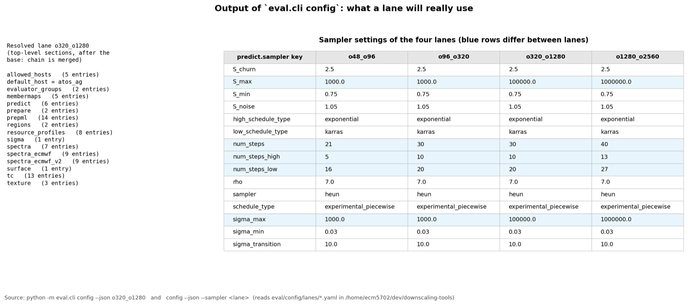
Figure caption: The left box lists the top-level sections of the lane `o320_o1280` after its `base:` chain has been merged, and the table on the right gives the sampler settings of the four lanes side by side, with the rows that differ between lanes shaded blue. Both come from `python -m eval.cli config` run in `/home/ecm5702/dev/downscaling-tools` on `hpc-login` at commit c7e1ccf, which reads the lane files in `eval/config/lanes/`. The command only reads configuration and computes nothing.

### 3.1.14 `ladder`

**Question it answers.** Is a training run improving, checkpoint by checkpoint, when every checkpoint and a frozen baseline are scored with the identical recipe?

**Method.** A profile file in `eval/config/ladder/` pins a lane, a host, a small budget of dates, steps and members, a sampler, evaluator settings, SLURM resources and (optionally) a number of extra noise draws (`seed_draws`). `ladder score` writes and submits one batch job per checkpoint (`eval/jobs/ladder.py:199`). The job runs `eval.cli predict`, then `eval.cli evaluate --only tc,probabilistic` (`DEFAULT_EVALUATORS`, `:45`) and, in a separate call that is allowed to fail, `spectra_ecmwf_v2` (`:151`), then the backend `storm_maps.render` directly (not through the registry), and finally `ladder collect`, which reads the evaluators' `metrics.json` files and stores selected metrics in the card `ladder.json`: probabilistic CRPS, spread and RMSE over the tropics and the northern hemisphere, the spectra rows, the raw TC extremes, the storm-map fine-band ratio and slope, and any seed-draw statistics (`:333`). Because `eval.cli --lane` takes a lane name, the profile's evaluator settings are written into a generated lane file `eval/config/lanes/_ladder_<card_id>.yaml` (`derive_lane`, `:49`); never edit these. `ladder sweep` scores every unscored `step_*` checkpoint of a run root; `ladder loss` adds MLflow loss series to the card; `ladder plot` draws the card; `ladder gatherdraws` reduces the extra draws to eye and wind distribution statistics.

**Inputs and outputs.** Input: a profile and a checkpoint. Output: run artifacts under `/home/ecm5702/scratch/eval/ladder/<card_id>/step_<N>/` and the card `/home/ecm5702/perm/eval-ladders/<card_id>/ladder.json`.

**How to run it.**

```
python -m eval.jobs.ladder score --profile o96_o320_59e4_300k \
    --checkpoint <path/to/step_0200000.ckpt> --step 200000
python -m eval.jobs.ladder sweep --profile <profile> --run-root <training run root>
```

**Cost and constraints.** Each rung is one GPU job, with a declared walltime of 4 hours in the profiles I read (2 hours for the 59e4 profile). The TC numbers at ladder budget are trend indicators, never verdicts: the module docstring and each card quote a single-run replica noise of plus or minus 7.0 and 4.8 hPa at the deepest of ten members.

**How to read the result.** Read the trend across rungs together with the baseline row, using `evolution` to draw against the input and target anchors. Names of spectra rows changed on 28 September 2026: cards scored earlier hold `spectra_<field>_*` (retired HEALPix proxy) and later ones `spectra_v2_<field>_*`; the two are never plotted on one axis.

**Overlaps.** `evolution` reads the cards; `tc`, `probabilistic` and `spectra_ecmwf_v2` do the measuring.

**Keep, merge or retire?** My recommendation is to keep it. It is the only tool with a cadence, and 22 cards exist.

**Figure.**
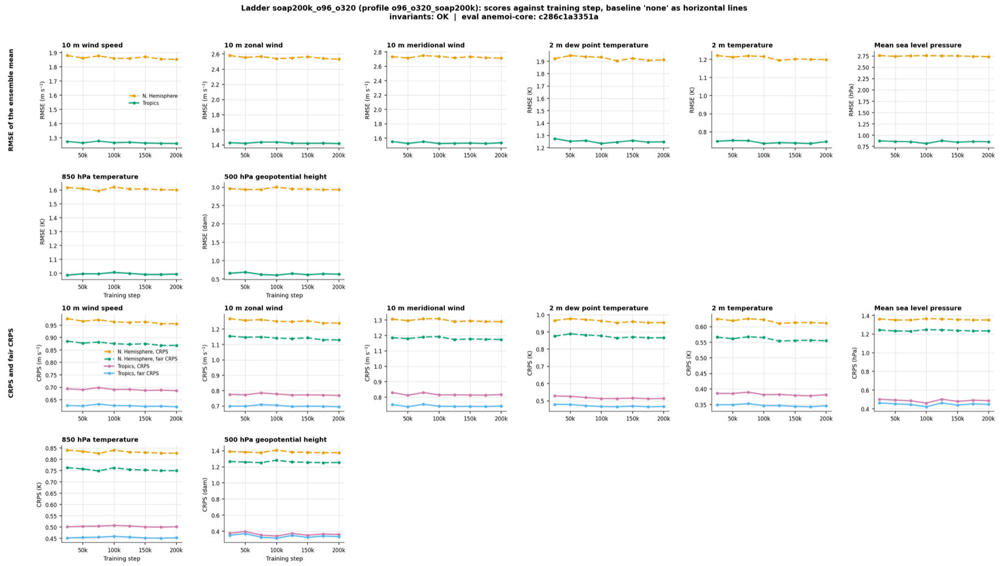
Figure caption: This is the ladder card of the training run `soap200k` on the o96_o320 lane, checkpoints from 25,000 to 200,000 training steps, cropped to its first two groups of rows: the root mean squared error (RMSE) of the ensemble mean, and the Continuous Ranked Probability Score (CRPS) with its fair version, each for one weather state per panel and with one line per region (Northern Hemisphere and Tropics). It was drawn by `python -m eval.jobs.ladder plot --profile o96_o320_soap200k` from `/home/ecm5702/perm/eval-ladders/soap200k_o96_o320/ladder.json`; the full figure has 34 panels, and the spectral rows below these were cut here to keep the picture readable. The card records no baseline, so no panel is marked better or worse, and every curve is nearly flat over the training.

### 3.1.15 `pipeline`

**Question it answers.** Can a chain of SLURM jobs (predict, one job per evaluator, scoreboard) be generated with dependencies between them?

**Method.** `render_pipeline` reads the lane's default evaluator group and writes `01_predict.sbatch`, one `02_eval_<evaluator>.sbatch` per evaluator, `03_scoreboard.sbatch`, and `submit_pipeline.sh`, which submits them with `--dependency=afterok` (`eval/jobs/pipeline.py:113`). The evaluator jobs are chained one after another rather than run in parallel, because they share a run directory and would otherwise race on `plots/` (comment marked C1, `:172-232`). Resources per stage come from the lane's `resource_profiles`. Each script starts with preflight checks.

**Inputs and outputs.** Input: lane, host, checkpoint. Output: the scripts in `--output-dir`; nothing is submitted until you run `submit_pipeline.sh`.

**How to run it.**

```
python -m eval.jobs.pipeline --lane o320_o1280 --host atos_ac \
    --checkpoint <ckpt> --output-dir <scripts_dir>
bash <scripts_dir>/submit_pipeline.sh
```

**Cost and constraints.** Generation takes seconds. Only the default group is used, so diagnostics need `--only` in a separate call. `eval/FULL_SUITE_PLAYBOOK.md` names a file `02_eval_spectra.sbatch`, which is out of date: the file is now named after the evaluator, `02_eval_spectra_ecmwf_v2.sbatch`.

**How to read the result.** Read the submission log and the job outputs; the evaluation results are those of `evaluate`.

**Overlaps.** `run` does the same in one allocation.

**Keep, merge or retire?** My recommendation is to keep it, but to ask whether it is used: I found two generated `submit_pipeline.sh` files under scratch, against 22 ladder cards and over a thousand run directories made by `run` or `evaluate`.

**Figure.**
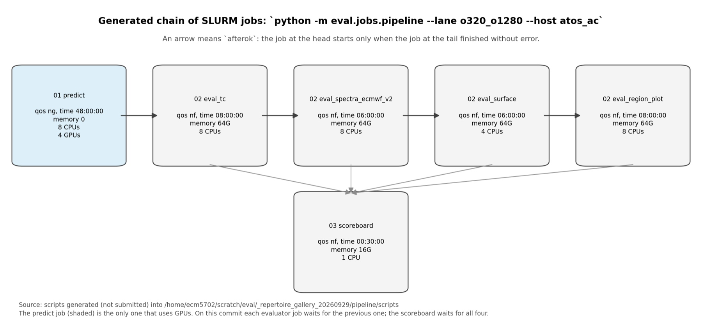
Figure caption: The boxes are the SLURM batch jobs that `python -m eval.jobs.pipeline --lane o320_o1280 --host atos_ac` generates, with the resources each script requests, and an arrow means that the job at its head starts only when the job at its tail has finished without error. The scripts were generated for the checkpoint at step 400,000 into `/home/ecm5702/scratch/eval/_repertoire_gallery_20260929/pipeline/scripts/` and were not submitted. Only the predict job (shaded) requests GPUs; on this commit each evaluator job waits for the previous one, and the scoreboard job waits for all four.


## 3.2 Scored evaluators

An evaluator is "scored" when the registry says its `score()` records reach `scoreboard/scores.csv` (`eval/evaluators/registry.py:72-101`). Five are so marked. Only three of them have produced results that I could find.

### 3.2.1 `tc`

**Question it answers.** How deep and how strong are the model's tropical cyclones, read as raw extremes of MSLP and 10 m wind next to the truth, the input and the operational analysis, all on one support?

**Method.** For each event in the lane's `tc.events` (by default `idalia` and `franklin`, with the boxes 10 to 40 N, 100 to 80 W and 15 to 38 N, 78 to 58 W from `eval/config/events/*.yaml`), the evaluator builds one pooled sample per source. A sample contains every grid point inside the event box, for every member, every lead time and every initial date whose prediction file matches the event. MSLP is the stored pressure divided by 100 (hPa). Wind speed is `hypot(10u, 10v)` (m/s). There are four sources: the model (`y_pred`), the input (`x_interp`, labelled for example "input O320"), the target (`y`, labelled for example "target O1280") and the operational analysis (OPER-AN, read from GRIB files under the lane's `tc.grib_dir`, expid `tc.analysis_expid`). ENFO and EEFO GRIB references, when listed, are capped at `max_pf_members` (default 10) so that they are sampled at the ensemble size of the model (`eval/evaluators/tc/runner.py:268`).

On the default support mode `regridded`, all values are put on a regular 0.25 degree grid over the box (`eval/evaluators/tc/core/plot_config.py:13`). The analysis is regridded with metview. The model, input and target are taken from the prediction files: by linear interpolation when the source grid is a structured latitude-longitude grid, and by nearest neighbour otherwise (`eval/evaluators/tc/core/loading_predictions.py:342-373`). The octahedral O1280 grid is not a structured grid, so, as far as I can see, model, input and target are sampled by nearest neighbour while the analysis is regridded by metview: the two paths share the same target points but not the same interpolation. Before any statistic is computed, `validate_curve_support_contract` checks that all curves carry the same support signature (`eval/evaluators/tc/runner.py:423`).

Per source, the statistics are the minimum, the 0.01th percentile, the maximum and the 99.99th percentile, with the names `mslp_min`, `mslp_p001`, `wind_max` and `wind_p9999` (`eval/evaluators/tc/core/stats.py:208-215`, inside `extreme_tail_table` at `:182`). The 0.01th percentile of MSLP is the value below which one pooled point in ten thousand lies, and the 99.99th percentile of wind is the value above which one in ten thousand lies. The scoreboard records are `tc_<event>_<stat>` for the model and `tc_<event>_oper_<stat>`, `tc_<event>_enfo_<stat>`, `tc_<event>_eefo_<stat>` for the references, all in hPa or m/s, with no score or ratio (`eval/evaluators/tc/scorer.py:25-30` and `:33`). The `enfo` column is taken from the target curve stored in the bundle (`bundle_enfo_labels`, `:74`). The full `stats.json` also holds histograms, summary statistics, a tail index, the fraction of points with MSLP between 980 and 990 hPa or wind above 25 m/s, and distances between each distribution and the analysis's (L1, total variation, Kolmogorov-Smirnov, Kullback-Leibler, Jensen-Shannon) (`eval/evaluators/tc/core/workflows.py:209`).

Known caveats. First, the sample sizes differ greatly: in the Idalia example below the model and the target each pool 2,450,250 values and the analysis pools 49,005, so a raw minimum is compared across samples that differ by a factor of fifty. Second, single-seed extremes are noisy: the project rules give 8 to 12 hPa of noise for a single seed and about 5 to 7 hPa for the difference of a single storm between two runs. Third, the percentile names are misdocumented in several places (section 5). Fourth, the lane keys `tc.beta`, `tc.mslp_ref` and `tc.tail_keys` are not read by any code I could find.

**Inputs and outputs.** Inputs: prediction files, and for the analysis the GRIB files under `tc.grib_dir`. Outputs in `evaluators/tc/`: `stats.json`, `metrics.json`, `plots/all_tc_distributions.pdf` (promoted to `tc_pdf_distributions.pdf`), and optionally `member_maps/` (one map page per member, controlled by `tc.member_maps`).

**How to run it.**

```
module load ecmwf-toolbox
python -m eval.cli evaluate --lane o320_o1280 --host atos_ac \
    --predictions-dir <run>/predictions --only tc --run-label <label>
```

**Cost and constraints.** It needs no GPU. I measured about 51 minutes for the five-date, ten-member Idalia and Franklin set on 8 CPUs and 64 GB (job `se_tc_eval_RU100k`). The regridded mode needs metview, that is `module load ecmwf-toolbox`, and `eval.cli` refuses to start without it rather than silently fall back to native support (`eval/cli.py:1543`). Metview exists on AC only.

**How to read the result.** Read the four numbers for the model beside the target (ENFO), the input and the analysis, per event, and compare runs only on the same support and the same dates. A good model sits between its input and the target, and close to the target. Example, from `/home/ecm5702/scratch/eval/o320_o1280/global_mixture_test_20260922/se_R47kT12_idalia/eval_full/evaluators/tc/stats.json` (lane `o320_o1280`, regridded, five dates, leads 24 to 120 h, 10 members):

| Event and source | Minimum MSLP (hPa) | 0.01th percentile MSLP (hPa) | Maximum wind (m/s) | 99.99th percentile wind (m/s) |
|---|---|---|---|---|
| Idalia, model | 971.5 | 987.0 | 40.4 | 23.6 |
| Idalia, target (ENFO) | 962.4 | 985.7 | 45.1 | 23.4 |
| Idalia, input (O320) | 986.8 | 991.2 | 24.1 | 20.3 |
| Idalia, OPER-AN | 984.0 | 987.9 | 25.5 | 24.4 |
| Franklin, model | 953.1 | 967.8 | 52.7 | 36.4 |
| Franklin, target (ENFO) | 942.7 | 965.1 | 57.6 | 36.6 |
| Franklin, input (O320) | 973.6 | 981.6 | 29.1 | 25.7 |
| Franklin, OPER-AN | 951.0 | 966.5 | 41.6 | 35.0 |

The model recovers most of the depth that the input lacks, and stays 9 to 10 hPa shallower than the target at the minimum. The analysis row is deeper than the model on Franklin and shallower on Idalia, which shows why its much smaller sample must be kept in mind.

**Overlaps.** `tctracker` and `tccompare` follow individual storms through time from FDB data. `tc_structure` measures centre, wind profile and radii for the same storms. `wind_extremes` asks whether the wind maximum is a coherent feature. `storm_maps` draws the deepest storm.

**Keep, merge or retire?** My recommendation is to keep it, because it is the tool that speaks to the project's main question (real extremes). Two improvements to consider: print the pooled sample size next to each extreme in `metrics.json`, and correct the percentile names in the documentation.

**Figure.**
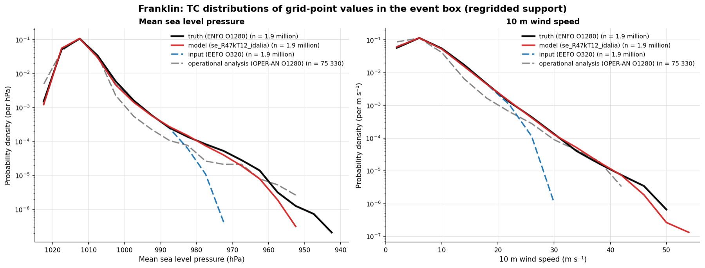
Figure caption: The curves show the distribution of every grid-point value of mean sea level pressure (left) and 10 m wind speed (right) inside the box around Hurricane Franklin, on a common regridded support: black is the truth (ENFO on O1280), red the model, blue dashed the input (EEFO on O320) and grey dashed the operational analysis (OPER-AN, the best estimate of the real atmosphere). The model follows the truth closely and the input stops far earlier in the tail; in the pressure tail the model's curve ends before the truth's, while in the wind tail it reaches slightly beyond it. The data are `/home/ecm5702/scratch/eval/o320_o1280/global_mixture_test_20260922/se_R47kT12_idalia/eval_full/evaluators/tc/stats.json` (five start dates, 25 prediction files), drawn at commit c7e1ccf.

### 3.2.2 `surface`

**Question it answers.** How large is the model's pointwise error on the surface variables, as a normalised mean squared error per variable and as an area- and variable-weighted total?

**Method.** For each prediction file, member and surface variable, the evaluator computes the area-weighted mean of the squared difference between `y_pred` and `y` over all grid points, using the file's own `area_weight`, or else the cosine of latitude, as weights (`eval/evaluators/surface/core/compute.py:95`, `:131`). If the truth has a single member it is copied to every model member (`:217`), so every model member is compared with the same truth field. If the truth has as many members as the model (the ENFO lanes), member k of the model is compared with member k of the truth; that pairing is only a storage convention, so the error includes the scatter between two unpaired ensembles and has a floor above zero even for a perfect model. The per-variable mean squared error is the mean over all (file, member) samples. It is divided by the variance of the truth for that variable, pooled over all files, members and points, computed with running moments (`:148-176`, `:295`). That is the nMSE. The total is the weighted mean of the per-variable nMSE with the weights 10u 2.5, 10v 2.5, 2d 2.0, 2t 2.0, msl 2.0, skt 0.5, sp 1.5, tcw 1.0 (sum 14.0), which are the weights of the training loss scalers (`:16-28`, `:309`). Variables whose truth is all NaN are dropped from the list (for example on the o2560 lane, which carries truth only for 10u, 10v, 2t and msl). The scoreboard records are `surface_weighted_nmse`, `surface_weighted_mse` and `surface_<variable>_nmse` (`eval/evaluators/surface/scorer.py:68`, `:76`). The lane key `surface.weighting` is read at `scorer.py:45` and then unused.

Two caveats follow from the code. The total `surface_weighted_mse` adds mean squared errors that have different units (pascal squared for `msl` and `sp`, kelvin squared, and so on), so it is dominated by pressure and carries no physical meaning. And a pointwise squared error is minimised by a smooth conditional mean, so it rewards blur; that is why it cannot judge extremes or fine-scale sharpness.

**Inputs and outputs.** Input: prediction files with `y_pred`, `y`, `weather_state`. Output: `evaluators/surface/surface_loss.json` and `metrics.json`.

**How to run it.**

```
python -m eval.cli evaluate --lane o320_o1280 --host atos_ac \
    --predictions-dir <run>/predictions --only surface
```

**Cost and constraints.** It runs on CPUs only, with no host restriction, and memory is kept bounded by loading one variable at a time. Together with `probabilistic` it took about 32 minutes on 256 CPUs in the rescore jobs.

**How to read the result.** Lower is better; the nMSE is a fraction of the truth's variance, so 0 is perfect and 1 is as bad as predicting the truth's mean. Example from `/home/ecm5702/scratch/eval/o320_o1280/global_mixture_test_20260922/se_R47kT12_full/guards/evaluators/surface/surface_loss.json` (25 files, 250 samples per variable): weighted nMSE 0.0752. By variable: 10u 0.146, 10v 0.219, 2d 0.0117, 2t 0.0055, msl 0.0256, skt 0.0047, sp 0.0007, tcw 0.0495. Weighting each by its share of 14 gives contributions of about 0.026 (10u) and 0.039 (10v) out of the 0.0752, so the two wind components make up about 87 per cent of the headline number: the weighted nMSE is in practice a wind error. The same file shows the mixed-unit problem: `weighted_surface_mse` is 7,702.8, of which the `msl` and `sp` terms (31,397.9 and 29,999.7 Pa squared) supply nearly everything.

**Overlaps.** `probabilistic` scores the same fields with CRPS, which rewards honest spread rather than a smooth mean.

**Keep, merge or retire?** My recommendation is to keep `surface_weighted_nmse` and the per-variable nMSE as a regression guard (does a change break the pointwise fit?), stop publishing `surface_weighted_mse`, and say clearly that the weighted nMSE is dominated by wind.

**Figure.**
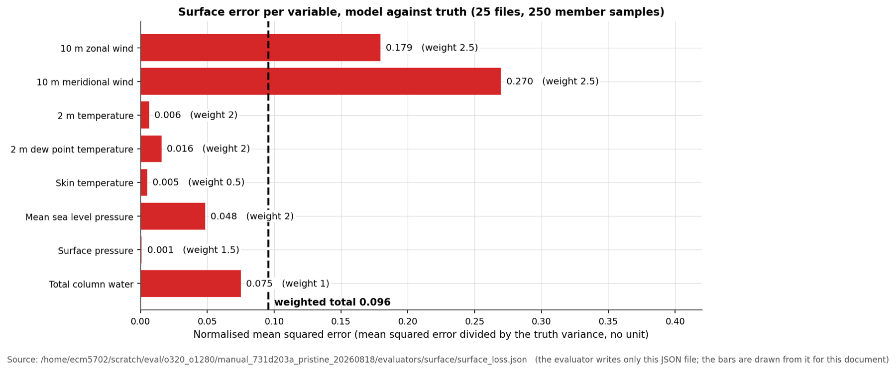
Figure caption: Each bar is the normalised mean squared error (mean squared error divided by the variance of the truth, without unit) of one surface variable for the model against the truth, and the dashed line is the weighted total that the scoreboard uses; the weight of each variable is written next to its bar. The evaluator writes only the JSON file `/home/ecm5702/scratch/eval/o320_o1280/manual_731d203a_pristine_20260818/evaluators/surface/surface_loss.json` (25 prediction files, 250 member samples), so the bars were drawn from it for this document with the house style, not by the evaluator. The 10 m wind components have the largest errors and surface pressure the smallest.

### 3.2.3 `spectra_ecmwf_v2`

**Question it answers.** Does the model's power spectrum, computed with the ECMWF spectral transform on the complete grid, match the truth's spectrum at fine scales, that is at total wavenumbers above 100?

**Method.** In three stages (`eval/evaluators/spectra_ecmwf_v2/runner.py`). Stage one writes each selected field, for each (date, step, member), into a GRIB file on the complete octahedral grid, using a template GRIB (the lane key `template_root`) (`_grib_stager.py:145`). Stage two runs the ECMWF program `gptosp.ser -T <truncation>` to transform each field into spherical harmonic coefficients (`runner.py:604-646`); the truncation is the nominal one of the output grid: 95 for O96, 319 for O320, 1279 for O1280, 2559 for O2560. Stage three reads the coefficients with eccodes (ECMWF's GRIB library) and forms the amplitude at each total wavenumber n as the square root of the sum over the zonal wavenumber m from 0 to n of the squared real and imaginary parts, without doubling the terms with m greater than 0; this is the convention of the Metview function it replaced, and it differs from the per-degree variance only by a constant factor above n of about 100, which cannot change a score there (`eval/evaluators/spectra_ecmwf_v2/core/harmonics.py:83`, `:122`). The truth curves come from the stored `y` of the same files, the input curves from `x_interp` (or from the coarse bundles), and both are computed once and cached under the lane's `reference_dir`, in a folder whose name encodes the dates, steps, members, truncation and template (`runner.py:264`), so that a reference for one month can never be reused for another (an earlier version scored a September 2025 run against 2023 truth).

The score. For each variable, the amplitude curves of all (date, step, member) samples are averaged over samples, separately for the model and for the truth. The relative L2 error is `||P - T|| / ||T||` over the wavenumbers above 100 where both mean curves are finite and positive, unweighted (`eval/evaluators/spectra_ecmwf_v2/scorer.py:62`, `:177`; `eval/evaluators/spectra_ecmwf_v2/core/scoreboard.py:72`). The per-variable score is `max(0, 1 - relative L2)`. The mean over variables is reported only when at least three variables were scored (`scorer.py:51`). When the grid's truncation does not exceed 100 (the O96 lane, truncation 95) the band starts at one third of the largest wavenumber (`scorer.py:54`). The records are `spectra_v2_<variable>_relative_l2`, `spectra_v2_<variable>_score`, `spectra_v2_mean_relative_l2` and `spectra_v2_mean_score`; the names differ on purpose from the retired proxy's `spectra_*`. The lane files default to one member (`members: [1]`), the single step 120, and the variables listed in each lane (10u, 10v, 2t, t_850 and z_500, plus `msl` on the o320 to o1280 lane or `sp` on the o96 to o320 lane).

Caveat from reading the formula. The L2 norm of an amplitude curve that falls steeply with wavenumber is dominated by the lowest wavenumbers of the band, so a score computed over 101 to 1279 mostly measures scales of roughly 100 to 300 in wavenumber, not the finest ones. This is my inference from the formula, not something the code states. It is consistent with the old proxy rows, which sit between 0.97 and 0.99 for good runs (`/home/ecm5702/scratch/eval/o320_o1280_ft400k_gmass_20260821/eval_plots/ctrl30/scoreboard/scores.csv`: relative L2 from 0.008 for z_500 to 0.029 for msl) and so discriminate little.

**Inputs and outputs.** Inputs: prediction files, the template GRIBs, and the reference cache. Outputs in `evaluators/spectra_ecmwf_v2/`: `grb/`, `spectral_harmonics/`, `spectra/` (`.npy` curves), `spectra_summary.json`, `spectra_v2_scores.json`, `metrics.json` and PDFs of the spectra and their ratios to the reference.

**How to run it.**

```
python -m eval.cli evaluate --lane o320_o1280 --host atos_ac \
    --predictions-dir <run>/predictions --only spectra_ecmwf_v2
```

**Cost and constraints.** It runs on AC only: the registry sets `host_prefix="ac"` and the runner raises on any other host (`runner.py:114`). I measured 2 hours 17 minutes on 16 CPUs and 64 GB for a five-date, ten-member campaign (jobs `se_spectra_*_full`), and about 10 minutes for the quick version. Cost grows with dates times steps times members times variables, because gptosp is run once for every field.

**How to read the result.** Lower relative L2 (or higher score) is better; the value quantifies how far the mean amplitude spectrum is from the truth's above wavenumber 100, and a deficit at high wavenumbers means the members are too smooth. Amplitude and shape only: it is blind to phase, so a field with the right variance in the wrong places scores as well as a correct one (this is what `spectra_coherence` adds). I found no `spectra_v2_scores.json` on scratch, because the scorer was added on 28 September 2026 (`git` history of `scorer.py`), so no real v2 score can be quoted yet.

**Overlaps.** `spectra_coherence` splits the error into amplitude and phase, but with a different, HEALPix-based transform. `storm_maps` measures the regional spectrum of a storm box in the 40 to 150 km band. `texture` measures fine-scale statistics directly on the grid.

**Keep, merge or retire?** My recommendation is to keep it, because it is now the only spectra instrument. Consider two changes: report the mean L2 over a log-spaced set of sub-bands (for example 100 to 200, 200 to 400, 400 to 800, 800 to 1279) so that the finest scales count, and consider adding the coherence to this evaluator, since the coefficients of the model and of the truth are both already computed here (section 3.4, `spectra_coherence`).

**Figure.**
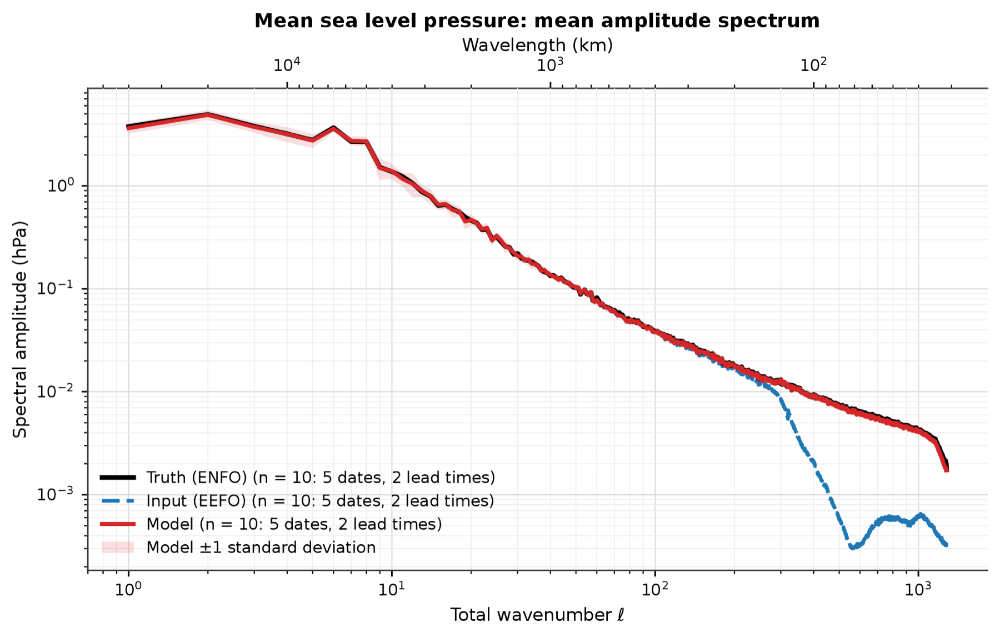
Figure caption: The curves show the mean amplitude spectrum of mean sea level pressure against the total wavenumber (large scales on the left, small scales on the right; the upper axis gives the wavelength in kilometres): black is the truth (ENFO), red the model with a band of one standard deviation, and blue dashed the input (EEFO). The model follows the truth down to the finest scales, whereas the input loses amplitude beyond a wavenumber of about 300, which is the fine-scale content the model has to add. The data are 10 samples (five start dates, two lead times) from `/home/ecm5702/scratch/eval/o320_o1280/global_mixture_test_20260922/se_R47kT08_full/spectra_v2_5d/evaluators/spectra_ecmwf_v2`, drawn at commit c7e1ccf; the full figure has six pages, one per variable.

### 3.2.4 `precip_scores`

**Question it answers.** How accurate is the model's six-hour precipitation, per member and for the ensemble mean, against the truth and against the interpolated input?

**Method.** The variable is `tp`, stored in metres per six-hour window and converted to millimetres (`eval/evaluators/precip_scores/runner.py:60`). The truth is the stored `y` when its tp channel is populated (fewer than 1 per cent NaN in a probe of the first file); otherwise the evaluator reads the GRIB file named by the lane's `precip.truth_grib_tpl` (`:117-131`). The "baseline" here is the interpolated input, `x_interp`, when its tp channel is a real series; on the o1280 to o2560 lane tp is an output-only channel and `x_interp` is all zeros, so the baseline is then the driving o1280 member's tp interpolated by nearest neighbour through `precip.baseline_lres_grib_tpl` (`:138`). This is not the lane baseline of section 1.2.

For each (date, step) and each member it computes, over all finite grid points, the root mean squared error, mean absolute error, bias and Pearson correlation of the model against truth (`eval/evaluators/precip_scores/core/metrics.py:63`), and the field's distribution statistics: mean, maximum, 99th, 99.9th and 99.99th percentiles (from a fixed histogram with 0.02 mm resolution, `:24`), the wet fraction (share of points above 0.1 mm) and the negative fraction (share of points below zero) (`:41`). The ensemble mean is scored the same way, and so is the baseline. Aggregation takes, per lead step, the mean over dates and members, then the mean over steps (`runner.py:250`, `:292`). Scoreboard records (`scorer.py:40-52`): `tp_rmse_mm` (mean of per-member RMSE), `tp_ens_rmse_mm`, `tp_bias_mm`, `tp_corr`, `tp_p999_ratio`, `tp_max_ratio`, `tp_wet_frac_ratio` (each model value divided by the truth's), `tp_neg_frac`, `tp_baseline_rmse_mm`, `tp_baseline_corr` and `tp_rmse_vs_baseline_ratio` (model RMSE over baseline RMSE; below 1 means the model beats interpolation).

Caveats. Raw precipitation values are used for RMSE, bias and correlation, with negatives clipped only inside the histograms. `tp_max_ratio` rests on a single grid point per slice, which is the noisiest possible reading; the code computes the 99.99th percentile as a quieter substitute (`metrics.py:41-56`) but the scorer does not publish it.

**Inputs and outputs.** Input: prediction files with a tp channel. Output: `scores.json`, `scores_rows.csv`, `metrics.json` and `plots/precip_scores.pdf` (skill and distribution tails against lead time).

**How to run it.**

```
python -m eval.cli evaluate --lane o1280_o2560_humberto6h_pristine --host atos_ac \
    --predictions-dir <run>/predictions --only precip_scores
```

**Cost and constraints.** It runs on CPUs and I did not measure its run time. It is configured only on the lane `o1280_o2560_humberto6h_pristine` (in its default group) and on `tc_o1280_o2560_arabian_extreme`.

**How to read the result.** Lower RMSE and higher correlation are better, `tp_rmse_vs_baseline_ratio` below 1 means the model beats interpolating its input, and the ratios should be near 1 for a model with a realistic distribution. I found no result directory named `evaluators/precip_scores` on scratch. The lane `lane_diagnostics` block points at `/home/ecm5702/scratch/eval/o2560_humberto_pristine_fixed_20260822T082649Z/data/evaluators/precip_scores/scores.json`, which no longer exists (scratch cleaning), so no value can be quoted.

**Overlaps.** `precip_dist` draws the full value distribution, `precip_events` the heaviest events, and `lane_diagnostics` consumes this evaluator's output.

**Keep, merge or retire?** My recommendation is to keep it only if six-hour precipitation on the o1280 to o2560 lane is still a target; otherwise retire it together with `precip_dist` and `precip_events`. If kept, consider moving the group from "scored" to "diagnostic" until a result exists, because it currently promises scoreboard rows that have never appeared.

**Figure.**
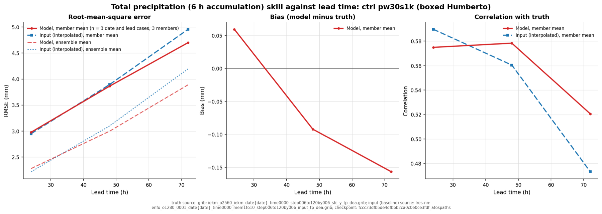
Figure caption: The three panels show, against lead time, the root mean squared error (RMSE), the bias (model minus truth) and the correlation with the truth of six-hour precipitation in millimetres, for the model (red) and the interpolated input (blue dashed), with thin lines for the ensemble mean. The evaluator was run again for this document on three prediction files (start 26 September 2025, lead times 24, 48 and 72 hours) and three members of the run labelled `ctrl pw30s1k` on the o1280_o2560 lane, in a box around Hurricane Humberto, with the truth from IEKM (the kilometre-scale simulation); the predictions are in `/home/ecm5702/scratch/eval/tc_o1280_o2560_precip/links_ctrl_pw30s1k/` and the output is in `/home/ecm5702/scratch/eval/_repertoire_gallery_20260929/precip_scores/`. With only three cases the curves show the layout of the figure, not a reliable result.

### 3.2.5 `sigma_loss`

**Question it answers.** How large is the denoiser's loss at each noise level, per variable, when the checkpoint is run once on a noised truth field?

**Method.** The evaluator loads the model and its datamodule from the checkpoint (through the `manual_inference` loader), captures the first K batches of the checkpoint's own validation split (default K 8 in the code, 16 in the o96 to o320 lane), and, for every noise level sigma of a grid (the lane lists sixteen values from 0.02 to 500), replaces the training noise sampler by a fixed sigma and runs the training step once per batch with a fixed noise seed (`eval/evaluators/sigma_loss/kernel/domain.py:54`, `:150`, `:211`). The loss weight is `(sigma^2 + sigma_data^2) / (sigma * sigma_data)^2`, which is `1 / c_out^2` of the EDM noise conditioning (EDM refers to the elucidated diffusion model formulation) (`domain.py:49`). The per-variable losses come from re-running the same weighted mean squared error without summing over variables, and their mean equals the task's total loss. So this is the training loss, in the network's normalised output space, evaluated on a grid of fixed noise levels. The scorer reports the total at the grid point nearest `sigma_data`, its mean over the "extreme" band (sigma 80 to 500) and over the "fine" band (0.05 to 0.3), and the sigma with the lowest total (`eval/evaluators/sigma_loss/scorer.py:77-111`): `sigma_loss_at_sigma_data`, `sigma_loss_mean_extreme`, `sigma_loss_mean_fine`, `sigma_loss_argmin_sigma`.

**Inputs and outputs.** Input: a checkpoint (not predictions); `--checkpoint` is mandatory (`runner.py:68`). Output: `data/sigma_loss/per_sigma.csv`, `meta.json`, `metrics.json` and a plot.

**How to run it.**

```
python -m eval.cli evaluate --lane o96_o320 --host atos_ac \
    --predictions-dir <any predictions dir> --checkpoint <base .ckpt> --only sigma_loss
```

**Cost and constraints.** It needs a GPU, with a declared walltime of one hour, and it needs the training data of the checkpoint (it reads the validation split). Multi-checkpoint sweeps are a stub in the code (`runner.py:74-82`).

**How to read the result.** Lower is better within one checkpoint family, and the shape across sigma shows where the network is weak. The project's own rule warns that the training and validation loss "never judges a run" because it is dominated by high-sigma noise and ranks runs backwards; this evaluator is that loss, only evaluated at chosen sigmas. No result directory exists.

**Overlaps.** `mlflow` plots the logged training and validation loss curves; `sigma_loss` recomputes them at fixed sigmas. The retired `sigma` evaluator did the same job with an older script.

**Keep, merge or retire?** My recommendation is to change its group from "scored" to "diagnostic". Its own module docstring says "Diagnostics-only; not run by default" (`eval/evaluators/sigma_loss/__init__.py:5`), it sits in the `diagnostics` group of the o96 to o320 lane, and it is only in the default group of the fast lane `o48_o96_fastlane` (`eval/config/lanes/o48_o96_fastlane.yaml:191`). Keep it as a diagnostic only if the sigma-banded probes continue; otherwise retire it, since it has produced no result on scratch.

**Figure.**
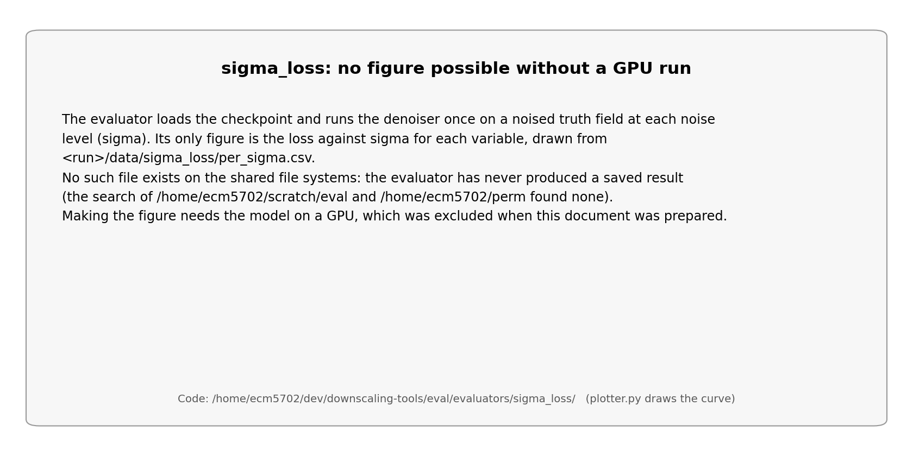
Figure caption: No figure is possible without a GPU run, so the image only says so. The evaluator loads the checkpoint and runs the denoiser on a noised truth field at each noise level, and its only figure is the loss against the noise level for each variable, drawn from `data/sigma_loss/per_sigma.csv`. No saved result of this evaluator was found on scratch or permanent storage, and running it needs the model on a GPU, which was excluded when this figure was made; the code is in `/home/ecm5702/dev/downscaling-tools/eval/evaluators/sigma_loss/`.


## 3.3 Standard evaluators

The registry defines "standard" as "runs by default on a lane but produces no scoreboard row". Two evaluators have this group.

### 3.3.1 `region_plot`

**Question it answers.** What do the model, the truth and the input look like side by side over the lane's fixed regions?

**Method.** The evaluator starts a subprocess of `eval._backends.region_plotting.plot_regions` on the first prediction file it finds, `pred_files[0]`, which means one initial date and one lead time (`eval/evaluators/region_plot/runner.py:42`). It passes every region box that the lane lists under `regions:` (for example `amazon_forest`, `himalayas`, `pyrenees_alpes`). For each region the backend cuts the region out of the prediction file (sample 0, ensemble member index 0, `plot_regions.py:124-125`) and draws a page in which each row is a weather state (by default `10u`, `10v`, `2t`, `msl`, `tp`, `z_500`, `u_850`, `v_850`, `t_850`, of those present) and the six columns are the coarse input (`x`), the interpolated input, the truth (`y`), the model (`y_pred`), the truth residual and the model's predicted residual (the defaults `x_0`, `x_interp_0`, `y_0`, `y_pred_0`, `residuals_0`, `residuals_pred_0` in `eval/evaluators/region_plot/core/plotting/config.py:81-82`; a residual is the field minus the interpolated input; the file `eval/evaluators/region_plot/config.py` repeats these lists but nothing imports it). It computes nothing.

**Inputs and outputs.** Input: one prediction file (the first). Output: `evaluators/region_plot/all_regions_plots.pdf` (promoted to the run root) and a manifest JSON.

**How to run it.**

```
python -m eval.cli evaluate --lane o320_o1280 --host atos_ac \
    --predictions-dir <run>/predictions --only region_plot
```

**Cost and constraints.** It runs on CPUs only; I measured 13 to 28 minutes on 8 CPUs and 64 GB (jobs `regionplot_R47k` and `regionplot_RU100k`). No host restriction.

**How to read the result.** Look for whether the model's fine detail sits where the truth's does, and whether the residual panels show structure or noise. Because it uses the first file only, it shows one case, so it cannot support a claim about the campaign.

**Overlaps.** `membermaps`, `storm_maps`, `precip_events` and the member maps of `tc` are four other figure generators. All render maps of the same files.

**Keep, merge or retire?** My recommendation is to keep it as the one standing overview figure. Consider making the choice of date, lead and member explicit in the lane file, because the silent choice of the first file makes the figure look representative when it is one draw.

**Figure.**
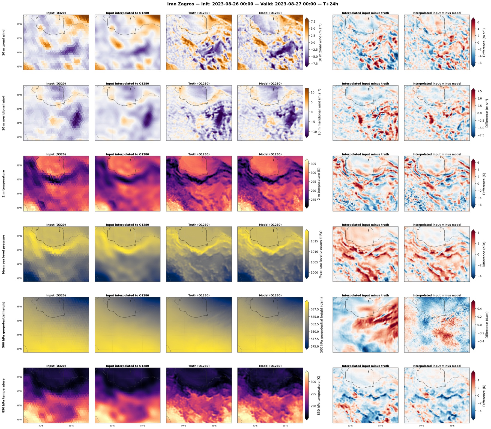
Figure caption: Each row is one weather state and the columns are the coarse input on O320, the input interpolated to O1280, the truth (ENFO on O1280), the model, and two difference maps (interpolated input minus truth, and interpolated input minus model), for the box `Iran Zagros` with start 26 August 2023 and lead time 24 hours. The panels of a row share one colour scale, and the difference maps are centred on zero. The data come from `/home/ecm5702/scratch/eval/o320_o1280/se_R47k_idalia/eval_full/evaluators/region_plot`, redrawn at commit c7e1ccf into `/home/ecm5702/scratch/eval/_repertoire_gallery_20260929/region_plot/`; this is page 1 of three boxes.

### 3.3.2 `probabilistic`

**Question it answers.** How good is the model ensemble as a probabilistic forecast, measured by CRPS, spread and ensemble-mean error per variable, region and lead time?

**Method.** For every prediction file and each variable in the list (default `2t`, `10ff`, `2d`, `msl`, `t_850`, `z_500`, where `10ff` is the wind speed `hypot(10u, 10v)` built member by member) it computes four pointwise quantities from the model members `f_1 ... f_m` and one truth field `y` (`eval/evaluators/probabilistic/core/scoring.py:96-141`):

- CRPS, estimated as the mean over members of `|f_i - y|` minus `(1/(2 m^2))` times the sum over all pairs of `|f_i - f_j|` (`:125-132`);
- fair CRPS, the same with the pair term divided by `2 m (m - 1)` instead of `2 m^2` (`:134`);
- spread, the standard deviation over members with `ddof=1` (`eval/evaluators/probabilistic/runner.py:44` sets the default);
- the squared error of the ensemble mean, `(mean(f) - y)^2`.

Points where the truth or any member is not finite are dropped. Each quantity is averaged over a domain with area weights (the file's `area_weight`, or the cosine of latitude), and for the ensemble-mean error the square root is taken after averaging, so it is a root mean squared error (`:280`). The domains are `n.hem` (latitude at least 20 degrees north), `tropics` (latitude between minus 20 and plus 20), `s.hem` (latitude at most minus 20) and `europe` (35 to 75 N, 25 W to 45 E) (`:58-70`). Per (step, variable, domain, metric) the values of the different dates are then summarised by mean, standard deviation and standard error over dates; the headline records are `probabilistic_<variable>_<domain>_<metric>_mean`, the unweighted mean over steps of these date means (`:144-192`).

The truth that enters is the stored `y` collapsed to its first member, whenever `y` holds more than one member (`:233-234`). This is a single ENFO member, not the member of the same forecast; the difference between the model's members and that member includes the ENFO ensemble's own scatter. Two consequences follow. The CRPS of a perfect model would not be zero. And the spread-to-skill ratio (spread divided by the RMSE of the ensemble mean) is not expected to equal 1 for a calibrated model, because the truth is not exchangeable with the members. The formulae carry no `(m + 1)/m` finite-ensemble factor. The project rule is to name the spread convention under every table; this one is the domain-weighted mean of the pointwise standard deviation, which is never larger than the square root of the mean variance used by the probe scripts in `eval/jobs/scripts/ag_crps_probe.py`.

**Inputs and outputs.** Input: prediction files with `y_pred` and `y`. Output in `evaluators/probabilistic/`: `scores_by_lead.csv` (one row per date, step, variable, domain, metric), `summary_by_lead.csv`, `probabilistic_summary.json`, `skipped.json`, `metrics.json` and `plots/probabilistic_scores.pdf`. It writes nothing to the FDB.

**How to run it.**

```
python -m eval.cli evaluate --lane o320_o1280 --host atos_ac \
    --predictions-dir <run>/predictions --only probabilistic
```

**Cost and constraints.** It runs on CPUs only, with no host restriction. I measured 15 to 20 minutes on 256 CPUs (jobs `sb_eval_prob_*`).

**How to read the result.** Lower CRPS is better. Compare the model with its own input (`x_interp`) and with a second ENFO member scored the same way (`eval/jobs/ladder_references.py` builds both references from the same files), never with a number from another support. Example from `/home/ecm5702/scratch/eval/o320_o1280/global_mixture_test_20260922/se_R47kT12_full/guards/evaluators/probabilistic/summary_by_lead.csv` (northern hemisphere, five dates, 10 members):

| Variable and lead | CRPS | Fair CRPS | Spread | Ensemble-mean RMSE |
|---|---|---|---|---|
| 2t (K), 24 h | 0.378 | 0.343 | 0.599 | 0.715 |
| 2t (K), 120 h | 0.603 | 0.547 | 0.960 | 1.180 |
| 10ff (m/s), 120 h | 1.004 | 0.917 | 1.510 | 1.924 |
| msl (Pa), 120 h | 132.7 | 121.0 | 204.0 | 290.1 |

The spread is 0.78 to 0.84 of the ensemble-mean error at 2t and 10ff, which on this truth is not by itself a verdict of under-dispersion, for the reason given above.

**Overlaps.** `quaver` scores the published ensemble against stations and analyses, which is the canonical verdict; the two must never be compared numerically. `spread_proxy` compares the model's spread with the spread of the full ENFO ensemble. `surface` measures the same fields with pointwise squared error.

**Keep, merge or retire?** My recommendation is to keep it, and to decide whether it is really "standard". None of the four canonical lanes lists it in its default group; it appears in the fast lane `o48_o96_fastlane`, in `tc_o320_o1280_regionalbundle`, and in every generated ladder lane. It is also the tool a ladder card reads, so moving it into the default group of the canonical lanes would match the registry's definition. Consider merging `spread_proxy` into it (section 3.4).

**Figure.**
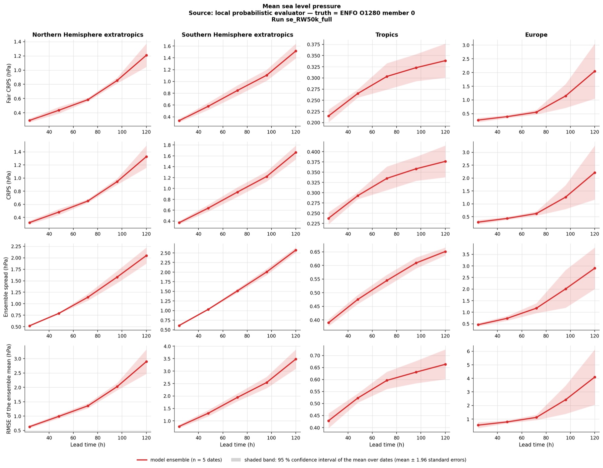
Figure caption: For mean sea level pressure, the rows are four scores (fair CRPS, CRPS, ensemble spread and RMSE of the ensemble mean, in hPa) and the columns are four regions, each plotted against lead time from 24 to 120 hours. The red line is the mean over five start dates (26 to 30 September 2025) and the shaded band is the 95 per cent confidence interval of that mean (plus or minus 1.96 standard errors over the dates), as the legend now says; the truth is member 0, the first member, of ENFO on O1280, which the figure title now takes from the lane configuration (o320_o1280) instead of a fixed text. The data are `/home/ecm5702/scratch/eval/o320_o1280/se_RW50k_full/guards/evaluators/probabilistic/summary_by_lead.csv`, redrawn at commit d46d457 of the branch style/figure-polish-20260929; the figure has one page per variable.


## 3.4 Diagnostic evaluators

A diagnostic evaluator is asked for explicitly (with `--only`, or through a lane's `diagnostics` group and `--include-diagnostics`). It explains a result; it does not rank runs. The fifteen diagnostic evaluators are described in this order: the four that measure fine scales (`texture`, `wind_extremes`, `displacement`, `spectra_coherence`), `membermaps`, the ensemble and precipitation group (`spread_proxy`, `precip_dist`, `precip_events`), `local_global`, `lane_diagnostics`, `mlflow`, `quaver`, `storm_maps`, and the two newest, `shape` and `tc_structure`. Note that most of them are written for the `o320_o1280` lane. `texture`, `wind_extremes` and `displacement` load the O320 to O1280 interpolation matrices (`interpol_O320_to_O1280_linear.mat.npz` and its inverse) from `INTER_MAT_DIR`; `spectra_coherence` uses degree bands that assume the O1280 truncation of 1279; and `shape` and `tc_structure` use constants of the O1280 grid (a fixed box in the first, the O1280 cell area in the second).

### 3.4.1 `texture`

**Question it answers.** Does the fine-scale texture of the model's fields, measured on the native O1280 grid with no regridding, have the same statistics as the truth's?

**Method.** For each prediction file, member and weather state (default `10u`, `10v`, `2t`, `msl`, `t_850`; `z_500` is left out on purpose because its fine band is numerically delicate), the evaluator forms the residual of the truth and of the model against the interpolated input, divided by the training residual standard deviation of that state, so that both are in the network's own units (`eval/evaluators/texture/runner.py:719`):

`r_truth = (y - up @ x) / stdev`, `r_model = (y_pred - up @ x) / stdev`

where `up` is the linear O320 to O1280 interpolation matrix. The "fine part" of a residual is what a round trip through the O320 grid cannot carry: `rf = r - up @ (down @ r)` (`:29`, `:482`). Per stratum, a boolean mask over the grid points, it computes for both the truth and the model: the variance of `r`; the variance of `rf`; the variance of the difference of `r` between each point and its zonal successor (its neighbour along the same latitude row, `zonal_diff_var`); the correlation between `rf` at a point and at its zonal successor (`fine_lag1_zonal`); the correlation between `rf` and the mean of `rf` over the six nearest neighbours (`fine_nn_corr`); the share of the total `rf` squared carried by the 5 per cent of points with the largest values (`top5_share`); and the excess kurtosis of `rf`. It reports model over truth for the variances and model minus truth for the two correlations.

Because the fine-part operator is a sharp high-pass filter, it leaves its own signature: Gaussian white noise passed through it gives a lag-1 correlation of about minus 0.66 and a nearest-neighbour correlation of about plus 0.11, not zero. So the evaluator also pushes white noise (two fixed seeds) through the same operator and reports a "grain index" `(model - truth) / (noise - truth)` for the two correlations: 0 means the model is textured like the truth, 1 means it is indistinguishable from white noise (`:494`, `:504`). The strata are `all`; five terrain classes from the land-sea mask and the standard deviation of the orography over the 32 nearest neighbours (`ocean`, `open_ocean`, `coastal`, `flat_land` below 30 m, `mountain` above 150 m; `coastal` is ocean whose coarse-smoothed land-sea mask is at least 0.01); and the region boxes of the lane (`europe`, `alps`, `open_north_atlantic`, `west_tropical_atlantic`) (`:115-126`, `:324`). Means and standard deviations are taken over the (file, member) samples. The standard deviation of the model-minus-truth differences is the null scatter that a later arm has to beat.

**Inputs and outputs.** Inputs: prediction files with `x`, `y`, `y_pred`; the interpolation matrices; the residual statistics file `o1280_dict_0_72.npy`; the land-sea mask and orography from the forcings zarr under `/home/mlx/ai-ml/datasets/`; and a 1.7 GB nearest-neighbour cache (`/home/ecm5702/hpcperm/data/static/o1280_knn32.npz`) that is built if absent. Outputs: `texture.json`, `texture_summary.md`, one PNG per state, and `metrics.json` with records named `tex_<state>_<stratum>_<statistic>_<truth|model|ratio|delta|sd|noise|grain>` (`eval/evaluators/texture/scorer.py:36`).

**How to run it.**

```
python -m eval.cli evaluate --lane o320_o1280 --host atos_ac \
    --predictions-dir <run>/predictions --only texture
```

**Cost and constraints.** It runs on CPUs and needs a lot of memory (the O1280 grid has 6.6 million points and 32 neighbours). The evaluator reported 4,136 seconds (69 minutes) for 25 files with 10 members each. The default matrices and grids are O320 to O1280; other lanes need the `paths` overrides.

**How to read the result.** The columns to read are the ratios of variance (1 is right), the correlation differences, and the grain index. Example from `/home/ecm5702/scratch/eval/o320_o1280/global_mixture_test_20260922/se_R47kT12_full/texture_v2/evaluators/texture/texture_summary.md` (250 samples per cell): for `10u` over all points, lag-1 correlation truth minus 0.351 and model minus 0.372, nearest-neighbour correlation 0.640 against 0.619, fine variance ratio 0.844, so the model's winds are somewhat smoother than the truth's. For `2t` over flat land the model is rougher: fine variance ratio 1.404 and lag-1 correlation minus 0.467 against minus 0.368. For `msl` over the open ocean the truth's excess kurtosis is 1449 against 625 for the model, so the model lacks the truth's rare intense points.

**Overlaps.** `spectra_ecmwf_v2` sees only amplitude; `spectra_coherence` sees phase agreement; `shape` sees the shape of wind features; `texture` tests statistics of the fine part directly on the grid, including its spatial structure.

**Keep, merge or retire?** My recommendation is to keep it. It is the "gate of the fine-scale epic" (lane file comment), it has been run 49 times, and it measures something no spectrum can. Consider adding it to the lane's `diagnostics` group so that `--include-diagnostics` runs it, since today it must be named.

**Figure.**
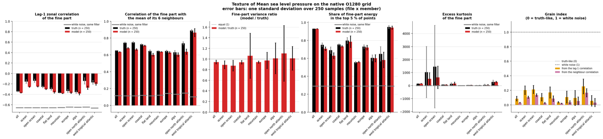
Figure caption: The six panels give statistics of the fine-scale part of mean sea level pressure on the native grid O1280 for ten kinds of area (all points, ocean, coastal, and so on): the bars are the truth (black) and the model (red) with error bars of one standard deviation over 250 samples (25 files times 10 members), and the grey lines give the value that white noise with the same filter would have. The last panel condenses the result into a grain index, where 0 means truth-like texture and 1 means white noise, and the model's values are small. The data are `/home/ecm5702/scratch/eval/o320_o1280/global_mixture_test_20260922/se_R47kT12_full/texture_v2/evaluators/texture` (start dates 26 to 30 September 2025), redrawn at commit c7e1ccf; the figure is wide, so it is 3,000 pixels across.

### 3.4.2 `wind_extremes`

**Question it answers.** Is the strongest 10 m wind in the model a coherent weather feature or isolated grid-scale noise?

**Method.** For each prediction file, member and geographical box, it builds three wind speed fields on the native O1280 grid: `W_model = hypot(y_pred[10u], y_pred[10v])`, `W_truth` from `y`, and `W_input` from `up @ x` (`eval/evaluators/wind_extremes/runner.py:1-60`). For each averaging radius R (10, 20, 30, 50, 75 and 100 km by default) it forms the disk average `S_R`, the mean of the field over all grid points within R kilometres (using great-circle chords in a k-d tree, `:141`). It then reports the peak, its location, the maximum of `S_R`, and `retention[R] = max(S_R) / peak`, which says how much of the maximum survives averaging: a coherent feature keeps most of its amplitude because its neighbours are strong too, whereas an isolated spike collapses towards the local mean. It also reports the local retention (`S_R` at the location of the peak, over the peak), the number of points above 90 and 95 per cent of the peak, the size and area of the connected patch above 90 per cent that contains the peak (`:197`), and the great-circle distance between the peaks of the model, the truth and the input. Boxes are padded by more than the largest radius so no disk is truncated, and statistics are taken inside the box. Default boxes are `west_tropical_atlantic` (10 to 32 N, 85 to 55 W), `open_north_atlantic` and `europe`; a lane may define its own. The verdict is the model minus truth difference on the same case, never an absolute threshold and never pooled across cases.

**Inputs and outputs.** Input: prediction files. Output: `wind_extremes.json`, `wind_extremes_summary.md`, one PNG per box, and `metrics.json` with records `wx_<box>_<statistic>_<model|truth|input>` and the `_delta` and `_sd` records (`scorer.py:26`).

**How to run it.**

```
python -m eval.cli evaluate --lane o320_o1280 --host atos_ac \
    --predictions-dir <run>/predictions --only wind_extremes
```

**Cost and constraints.** It runs on CPUs. The evaluator reported 449 seconds (7.5 minutes) for 8 files with 10 members (`/home/ecm5702/scratch/eval/o320_o1280_eowyn_20260902/eval_out/w13/evaluators/wind_extremes/wind_extremes.json`).

**How to read the result.** Compare the model's retention with the truth's for the same box. Example from `wind_extremes_summary.md` in that folder, box `ireland_scotland`, 80 samples: retention at 30 km is 0.915 for the model, 0.939 for the truth and 0.981 for the input, and the connected patch above 90 per cent of the peak has 33.5 grid points for the model against 46.1 for the truth. So the model's wind maximum is a little more concentrated than the truth's, and much more so than the smooth input's. The peak of the model lies 311.6 km from the peak of the truth in that box, but the truth's peak lies 303.8 km from the input's, and the model's peak lies only 170.0 km from its input's, so most of the offset from the truth is a difference between the two ensembles' weather, not something the model introduced.

**Overlaps.** `tc_structure` measures a cyclone's wind profile; `texture` measures the statistics of the fine part everywhere; `displacement` measures where features sit.

**Keep, merge or retire?** My recommendation is to keep it, as an optional tool; it has been used ten times, all on one case (Storm Eowyn, January 2025). Ask whether it will be used again outside that case study.

**Figure.**
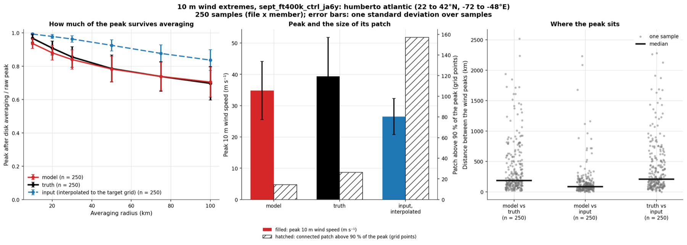
Figure caption: The left panel shows how much of the peak 10 m wind survives when the field is averaged over discs of growing radius, the middle panel shows the peak wind speed (filled bars) and the size of the connected patch above 90 per cent of the peak (hatched bars), and the right panel shows the distance between the positions of the peaks in model, truth and input. The box is `humberto atlantic` (22 to 42 degrees north, 72 to 48 degrees west), with 250 samples (file times member). The model's peak (about 35 m/s) is lower than the truth's (about 39 m/s) but higher than the interpolated input's (about 26 m/s), and its patch is small like the truth's while the input's patch is large; the data are in `/home/ecm5702/scratch/eval/o320_o1280/wind_extremes_20260902/sept_ft400k_ctrl_ja6y/evaluators/wind_extremes`, redrawn at commit c7e1ccf.

### 3.4.3 `displacement`

**Question it answers.** Does the model move weather features away from where its driving input puts them?

**Method.** In each box, the model field and the interpolated input are sampled by nearest neighbour onto a regular longitude-latitude mesh of 0.25 degree, padded by the search window, and smoothed at 0.5 degree so that only scales the input can carry remain (`eval/evaluators/displacement/runner.py:66-67`). The two fields are then compared under every whole-cell shift within a window of plus or minus 2 degrees. The shift with the highest correlation is refined to a fraction of a cell by a parabola through the correlation peak and its two neighbours, and reported in kilometres as an eastward and a northward component (positive means the second field's feature is east or north of the first's). The fields are MSLP and wind speed by default. It also finds the minimum of MSLP inside the box in the model, the input and the truth and reports their great-circle distances. Optionally (`include_coarsened_truth: true`) it measures the truth against its own coarsened copy (pushed down to O320 and back), which tells how far smoothing alone moves a feature and is the yardstick for the model's offset. The pairs are `model_vs_input`, `model_vs_truth`, `truth_vs_input` and `truth_vs_truthcoarse`. The verdict rests on model against input, because the truth is not the realisation that the input describes; model against truth is context only.

**Inputs and outputs.** Input: prediction files; interpolation matrices. Output: `displacement.json`, `displacement_summary.md`, PNGs per box and field, and `metrics.json` with `disp_<box>_<field>_<pair>_<east_km|north_km|distance_km|..._sd|corr_zero|corr_best>`.

**How to run it.**

```
python -m eval.cli evaluate --lane o320_o1280 --host atos_ac \
    --predictions-dir <run>/predictions --only displacement
```

**Cost and constraints.** It runs on CPUs. The evaluator reported 465 seconds (7.7 minutes) for 8 files with 10 members.

**How to read the result.** A displacement is real only when the median shift is away from zero by more than its scatter. Example from `/home/ecm5702/scratch/eval/o320_o1280_eowyn_20260902/eval_out/w13/evaluators/displacement/displacement_summary.md`, box `ireland_scotland`, MSLP, 80 samples: model against input, east minus 7.7 plus or minus 34.4 km, north 7.1 plus or minus 29.9 km, distance 31.8 km, correlation 0.995 at zero shift and 0.996 at the best shift. The mean shifts are far smaller than their scatter, so the model leaves the pressure pattern where its input put it.

**Overlaps.** `tc_structure` reports the displacement of a cyclone's centre from the ensemble-mean first guess. `wind_extremes` reports the distance between wind peaks.

**Keep, merge or retire?** My recommendation is to keep it as an optional tool with the same caveat as `wind_extremes` (ten uses, one case study). It could be merged with `wind_extremes` into one evaluator about where features sit, since both use the same boxes, files and matrices.

**Figure.**
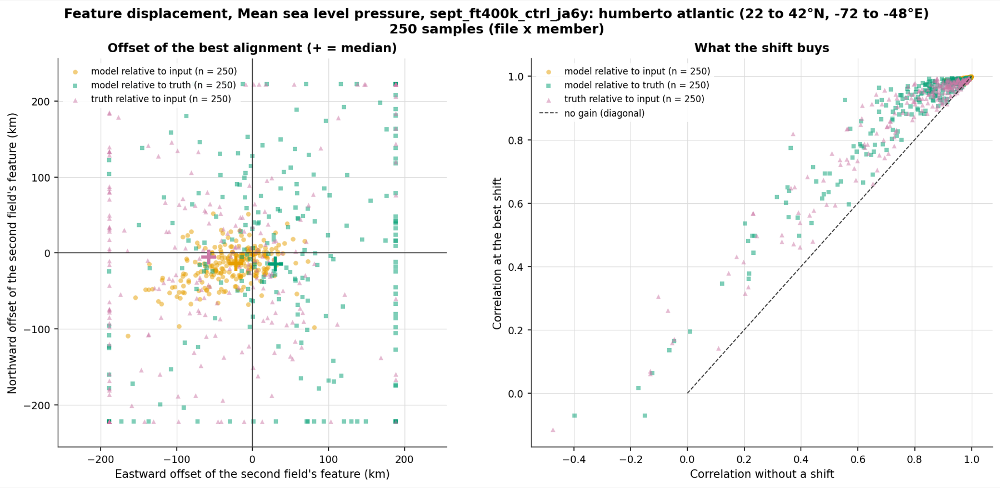
Figure caption: The left panel shows, for mean sea level pressure in the box `humberto atlantic`, the eastward and northward offset in kilometres that best aligns the second field's feature with the first field's, for model relative to input (orange), model relative to truth (green) and truth relative to input (purple), with a plus sign at each median; the right panel shows the correlation with and without that shift. The model's offsets relative to its input cluster near zero, which says that the model does not move features away from where its input puts them, while the offsets against the truth are widely scattered. The data are 250 samples (file times member) in `/home/ecm5702/scratch/eval/o320_o1280/wind_extremes_20260902/sept_ft400k_ctrl_ja6y/evaluators/displacement`, redrawn at commit c7e1ccf.

### 3.4.4 `spectra_coherence`

**Question it answers.** At each spatial scale, does the model have the truth's amplitude, and is it in phase with the truth?

**Method.** For each file, member and weather state (default `10u`, `10v`, `2t`, `msl`), the field on the unstructured grid is averaged into a HEALPix map (default nside 512), the map mean is removed, and a spherical harmonic transform gives coefficients `a_lm` (healpy `map2alm` with `iter=0`, `eval/evaluators/spectra_coherence/runner.py:62`, `:99`). Per degree l it accumulates the power of the truth `P_true = sum_m |a_lm(y)|^2`, of the prediction `P_pred`, and the cross term `X = sum_m Re[a_lm(y_pred) conj(a_lm(y))]`, averaged over all (file, member) samples. The amplitude ratio is `R = sqrt(P_pred / P_true)` and the coherence is `C = X / sqrt(P_pred P_true)`. The normalised per-degree error is exactly `E = 1 + R^2 - 2 R C`, and the smallest error attainable at that scale by any rescaling of the prediction is `E_floor = 1 - C^2` (`:240`). If `E_floor` is near 1 in the fine band, the fine content is phase-random texture that no sharpness knob can repair. The same quantities are computed for the interpolated input as the honest baseline. Results are summarised in bands (planetary 1 to 20, synoptic 20 to 100, meso 100 to 300, fine 300 to 500, very fine 500 to 700, near grid above 700), summing power and cross terms inside the band before forming the ratio (`:52`).

The choice nside 512 is deliberate: at nside 742, chosen to match the number of O1280 points, 12.2 per cent of the pixels received no source point, and the identical hole pattern in the model, truth and input manufactured coherence of 0.59 to 0.70 for the O320 input at degrees where it has no information (comment at `runner.py:139-151`). The price is a cap at degree 1024, 80 per cent of the resolved range. This evaluator therefore still relies on the HEALPix transform that was retired as a scoring instrument.

Two further modules in the package are not connected to anything: `stratified.py` (`run_stratified`, coherence by surface type) and `calibration.py` (`run_calibration`, whether the model's own uncertainty is consistent with its skill, from repeated draws). They have no command-line entry and nothing in the repository calls them (`stratified.py:139`, `calibration.py:61`).

**Inputs and outputs.** Input: prediction files with `y`, `y_pred` and preferably `x_interp`. Output: `coherence.json`, `coherence_curves.npz`, `spectra_coherence.pdf` and `.png`, and `metrics.json` with `coh_<state>_<band>_<amplitude_ratio|coherence|error_floor|interp_coherence>` (`scorer.py`).

**How to run it.**

```
python -m eval.cli evaluate --lane o320_o1280 --host atos_ac \
    --predictions-dir <run>/predictions --only spectra_coherence
```

**Cost and constraints.** It runs on CPUs, I did not measure its run time, and it needs the `healpy` package.

**How to read the result.** Amplitude ratio near 1 means the right amount of energy, and coherence near 1 means it is in the right places. Example from `/home/ecm5702/scratch/eval/o320_o1280_ladder_20260828/eval/s400000/evaluators/spectra_coherence/coherence.json` (step 120): for `10u` in the fine band (degrees 300 to 500) the amplitude ratio is 1.011, the coherence 0.333, the phase-only error floor 0.889, and the input's coherence 0.081; for `2t` in the same band the ratio is 0.976, the coherence 0.782 and the floor 0.389. So the wind's fine scales have the right energy but are mostly not in the right place, while the temperature's mostly are. The truth is an unpaired ENFO member, so part of the missing coherence is forecast divergence, not model error; the docstring of `calibration.py` says so.

**Overlaps.** `spectra_ecmwf_v2` gives amplitude only (with the ECMWF transform on the complete grid). `texture` tests fine-scale statistics directly.

**Keep, merge or retire?** My recommendation is to keep the idea, and to merge it into `spectra_ecmwf_v2`. That evaluator already computes the spherical harmonic coefficients of the model and of the truth with the ECMWF transform; the cross term needs the same coefficients, and it would remove the HEALPix dependence and the nside compromise. The two unconnected modules should be wired in or deleted.

**Figure.**
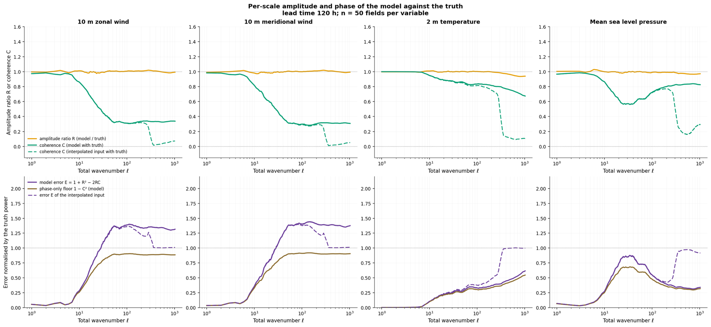
Figure caption: The top row shows, against total wavenumber, the amplitude ratio R of model to truth (orange) and the coherence C between model and truth (green; dashed for the interpolated input) for four variables, and the bottom row shows the error E = 1 + R squared - 2RC, normalised by the truth power, with the floor 1 - C squared that phase differences alone would give. The amplitude ratio stays near 1 at every scale, but the coherence of the wind components falls to about 0.3 at small scales, so the fine-scale error of the model comes from phase and not from amplitude. The data are lead time 120 hours and 50 fields per variable from `/home/ecm5702/scratch/eval/o320_o1280_ladder_20260828/eval/s400000/evaluators/spectra_coherence` (checkpoint at step 400,000), redrawn at commit c7e1ccf.

### 3.4.5 `membermaps`

Described together with the subcommand of the same name in section 3.1.12. In the registry it is a diagnostic evaluator with the question "What do the driving input, the truth and a model member look like on a map, as full fields and as high-pass fine-scale views?". Four result directories exist (usage count 4).

### 3.4.6 `spread_proxy`

**Question it answers.** Is the spread of the model ensemble similar to the spread of the ENFO truth ensemble?

**Method.** Both ensembles come from the same prediction file with the same number of members: the model's `y_pred` and the stored `y` (the ENFO target members). For each field it computes the pointwise standard deviation over members (`ddof=1`) for the model, the ENFO ensemble and the input, forms the area-weighted domain mean of each, and reports `spread_ratio = spread_ml / spread_enfo` (and `spread_ratio_input`) per (step, variable, domain) with mean and standard error over dates (`eval/evaluators/spread_proxy/core/scoring.py:108`, `:315`, `METRICS` at `:61`). Files in which either ensemble has fewer than two members are skipped (`:417`). It additionally bins the variance onto a 0.5 degree map to give ratio maps, and computes spread spectra by HEALPix binning (nside 256) to see whether excess spread sits in the fine band. Fields include `2t`, `10ff`, `10u`, `10v`, `2d`, `msl`, `sp`, `skt`, `tcw`, `t_850`, `z_500`; domains `global`, `n.hem`, `tropics`, `s.hem`, `europe`. No truth field enters any metric, so the unpaired-truth problem does not apply to the ratio. It can exclude the verifying ENFO member or subsample ENFO to a given number of members for external ENFO ensembles.

**Inputs and outputs.** Input: prediction files. Output: `spread_by_lead.csv`, `summary_by_lead.csv`, `spread_maps.npz`, `spread_spectra.npz`, `spread_proxy_summary.json`, `metrics.json` (headline records `spread_proxy_<variable>_<domain>_ratio_mean`), and plots.

**How to run it.**

```
python -m eval.cli evaluate --lane o320_o1280 --host atos_ac \
    --predictions-dir <run>/predictions --only spread_proxy
```

**Cost and constraints.** It runs on CPUs and I did not measure its run time. It needs `healpy` for the spectra readout, which is skipped with a warning if absent.

**How to read the result.** A ratio of 1 means the model spreads as much as ENFO; above 1 means over-dispersed relative to ENFO. Example from `/home/ecm5702/scratch/eval/o320_o1280/spread_proxy_ja6g/evaluators/spread_proxy/spread_proxy_summary.json`: global ratios 1.079 for `2t`, 1.064 for `msl`, 1.097 for `z_500` and 0.975 for `10ff`; northern hemisphere 1.149 for `2t`. The motivation recorded in the module docstring is that the champion class had measured 3 to 25 per cent over-dispersion against ENFO on quaver.

**Overlaps.** `probabilistic` also reports spread, but against a single truth member. `quaver` reports spread on the operational scorecard.

**Keep, merge or retire?** My recommendation is to merge it into `probabilistic` as extra rows ("spread of `y`" beside "spread of `y_pred`"), because the two read the same files with the same domains and the same weights. Only four result directories exist.

**Figure.**
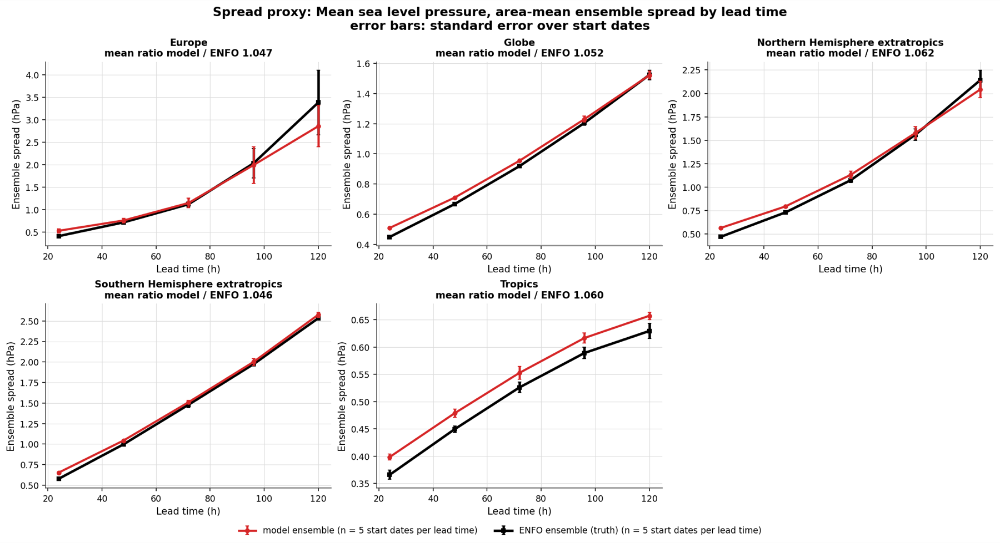
Figure caption: Each panel shows the area-mean ensemble spread of mean sea level pressure against lead time for one region, in red for the model ensemble and in black for the ENFO ensemble (the truth), with error bars that show the standard error over the five start dates; the panel titles give the mean ratio of model spread to ENFO spread, which is between 1.046 and 1.062 in all five regions. The model spread is therefore about five per cent above that of ENFO, most clearly in the tropics. The data are in `/home/ecm5702/scratch/eval/o320_o1280/spread_proxy_ja6y/evaluators/spread_proxy` (predictions from `/home/ecm5702/scratch/eval/o320_o1280/spectra_sept2630_ja6y/predictions`, start dates 26 to 30 September 2025), redrawn at commit c7e1ccf.


### 3.4.7 `precip_dist`

**Question it answers.** Does the distribution of the model's precipitation values match the truth's at each lead time?

**Method.** It runs the backend `eval._backends.precip.tp_histogram_comparison` as a subprocess (`eval/evaluators/precip_dist/runner.py:52`). The backend streams through all prediction files and accumulates, for each lead step and for three series (the interpolated input, the truth and the prediction), a fixed-bin histogram of the six-hour precipitation in millimetres: 600 bins with edges from 0.01 to 2048 mm spaced geometrically, plus a zero bin, with negative values clipped into the first bin (`eval/evaluators/precip_dist/core/tp_histogram_comparison.py:60-79`). Only one ensemble member is used, index 0 by default (`ensemble_member_index`, `:162`). The truth is the stored `y` if populated, else the GRIB template of the lane's `precip` block; the input is the stored `x_interp` if it is a real series, else the driving member interpolated by nearest neighbour, as in `precip_scores`. The output pages show, for the highlighted leads (6, 24, 48, 72 and 120 hours), densities on linear and logarithmic vertical axes and the cumulative distribution, an overlay of all leads, and a compact page (`style: compact` or `diagnostic`).

**Inputs and outputs.** Input: prediction files with a tp channel. Output: `plots/tp_histograms.pdf` and a folder `plots/tp_histograms_pages/` with one PNG per page (since the plot style change); no metrics.

**How to run it.**

```
python -m eval.cli evaluate --lane o1280_o2560_humberto6h_pristine --host atos_ac \
    --predictions-dir <run>/predictions --only precip_dist
```

**Cost and constraints.** It runs on CPUs, and its memory stays flat by design. I did not measure its run time.

**How to read the result.** Compare the model's curve with the truth's in the upper tail (the log-density page), and with the input's to see what the model adds. Three result directories exist; the one I opened (`/home/ecm5702/scratch/eval/manual_fb21124e_tp_only_ln35_75k_6h_eval/evaluators/precip_dist`) has an empty `plots/` folder, so I could not quote a value.

**Overlaps.** `precip_scores` reports a number for the same tail (`tp_p999_ratio`); `precip_dist` shows the whole curve.

**Keep, merge or retire?** My recommendation is to merge it into `precip_scores` as its plot, or retire together with it if six-hour precipitation is not a current target. It is a figure, not a measurement, and only three result directories exist.

**Figure.**
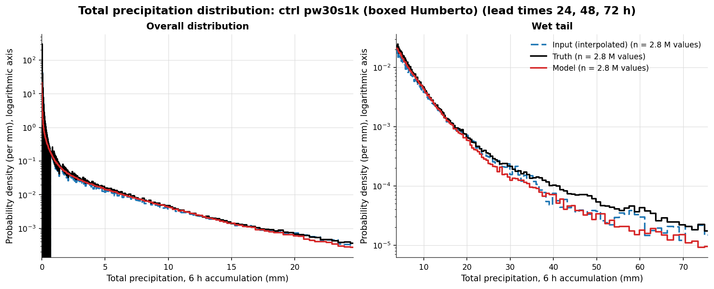
Figure caption: The left panel shows the probability density of six-hour precipitation values on a logarithmic axis, pooled over lead times 24, 48 and 72 hours, for the truth (black), the model (red) and the interpolated input (blue dashed), and the right panel enlarges the wet tail; each series holds 2.8 million values. The example uses the same three prediction files as `precip_scores` (start 26 September 2025, lane o1280_o2560, box around Hurricane Humberto). It was made with a small workaround script, `/home/ecm5702/scratch/eval/_repertoire_gallery_20260929/precip_dist_fixed.py`, because on main the truth of the first file is taken over the whole grid (26.3 million values instead of 0.94 million), which distorts the truth curve; the output is in `/home/ecm5702/scratch/eval/_repertoire_gallery_20260929/precip_dist/compact/`.

### 3.4.8 `precip_events`

**Question it answers.** What do the model and the truth look like at the heaviest precipitation events of the window?

**Method.** It ranks all (date, step) slices by the maximum of the truth's tp (member 0; or the prediction's, with `rank_by: pred`), takes the top N (default 3), and for each records the location of the maximum and a box of plus or minus 2.0 degrees in latitude and 2.5 degrees in longitude around it (`eval/evaluators/precip_events/core/precip_events.py:42-118`, `:96`). It writes `events.json` and then calls `plot_precip_events`, which draws one page per event with the region-plot panels cropped to that box, merged into `plots/precip_events_local.pdf`. It fails if the merged PDF is smaller than 1 kB (`eval/evaluators/precip_events/runner.py`, `_validate_pdf`). No numbers are scored.

**Inputs and outputs.** Input: prediction files with tp. Output: `events.json`, `plots/precip_events_local.pdf`.

**How to run it.**

```
python -m eval.cli evaluate --lane o1280_o2560_humberto6h_pristine --host atos_ac \
    --predictions-dir <run>/predictions --only precip_events
```

**Cost and constraints.** It runs on CPUs, and I did not measure its run time.

**How to read the result.** Judge by eye whether the model has an event of the right intensity and shape in the right place. Because the top events are chosen on the truth, the selection is deliberately extreme. Four result directories exist; the one I opened (`/home/ecm5702/scratch/eval/manual_fb21124e_tp_only_ln35_75k_6h_eval/evaluators/precip_events`) has no `events.json` at its top level.

**Overlaps.** `region_plot`, `storm_maps` and `membermaps` draw maps of other features; `precip_scores` scores precipitation numerically.

**Keep, merge or retire?** My recommendation is to retire it or to fold it into `region_plot` as an option ("centre the box on the strongest event"). Same reasoning as `precip_dist`.

**Figure.**
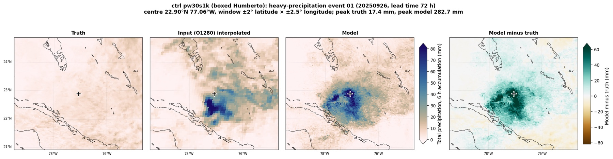
Figure caption: The four panels show the heaviest six-hour precipitation event found by ranking on the model's own maximum (`rank_by: pred`): the truth, the interpolated input, the model, and the model minus the truth, in a window of 2 degrees of latitude by 2.5 degrees of longitude around 22.9 degrees north, 77.1 degrees west, for the start of 26 September 2025 and lead time 72 hours. The model peaks at 282.7 mm in six hours where the truth peaks at 17.4 mm. The interpolated input already carries a heavy rain area at the same place, so the model is sharpening rain that its input forecast contains, while the truth, which is a separate kilometre-scale simulation, has almost no rain there. The large "model minus truth" difference therefore mainly shows the disagreement between the input forecast and the truth simulation, not rain invented by the downscaling. Ranking events on the model's own maximum favours such cases. It uses the run labelled `ctrl pw30s1k` on the o1280_o2560 lane (predictions in `/home/ecm5702/scratch/eval/tc_o1280_o2560_precip/links_ctrl_pw30s1k/`), with the truth from IEKM (the kilometre-scale simulation), evaluated again for this document into `/home/ecm5702/scratch/eval/_repertoire_gallery_20260929/precip_events/`.

### 3.4.9 `local_global`

**Question it answers.** Does the model run on a local cut-out of the globe give the same answer as the model run on the whole globe?

**Method.** For each local prediction file it finds the file of the same name in a directory of global predictions, matches every local grid point to a global grid point by rounded latitude and longitude within a tolerance (default 1e-6 degree) (`eval/evaluators/local_global/core/parity.py:97`), crops the global file to those points, and for each of `y_pred`, `y` and `x_interp` computes the maximum absolute difference, the mean absolute difference and the root mean squared difference (`:58`). It also computes the minimum MSLP and the maximum wind of the model in both and their absolute differences (`:79`). The headline records are the largest values over files: `local_global_<variable>_max_abs`, `local_global_<variable>_rmse_max`, `local_global_tc_min_msl_hpa_abs_diff_max` and `local_global_tc_max_wind_ms_abs_diff_max`. It needs the lane key `local_global.global_predictions_dir`.

**Inputs and outputs.** Inputs: local predictions, global predictions with the same file names. Output: `local_global_parity.json` and `metrics.json`.

**How to run it.**

```
python -m eval.cli evaluate --lane tc_o320_o1280 --host atos_ac \
    --predictions-dir <local run>/predictions --only local_global
```

**Cost and constraints.** It runs on CPUs, with a declared walltime of one hour. It is configured only in the lane `tc_o320_o1280`, where the global directory is hard-coded to `/home/ecm5702/scratch/eval/full_b785bf12_e080_s374868_idalia_franklin_20260624T154021Z/manual/all_predictions`. That directory no longer exists (scratch cleaning), so the tool cannot run as configured.

**How to read the result.** Zero, or floating-point noise, means the local cut-out is exact. It is a regression test of the local-graph machinery, not a measure of forecast skill. No result directory exists.

**Overlaps.** No other evaluator overlaps with it.

**Keep, merge or retire?** My recommendation is to turn it into a test (or a one-off script) and retire the evaluator, unless a local-graph change is planned; it has never produced a result under scratch and its reference data are gone.

**Figure.**
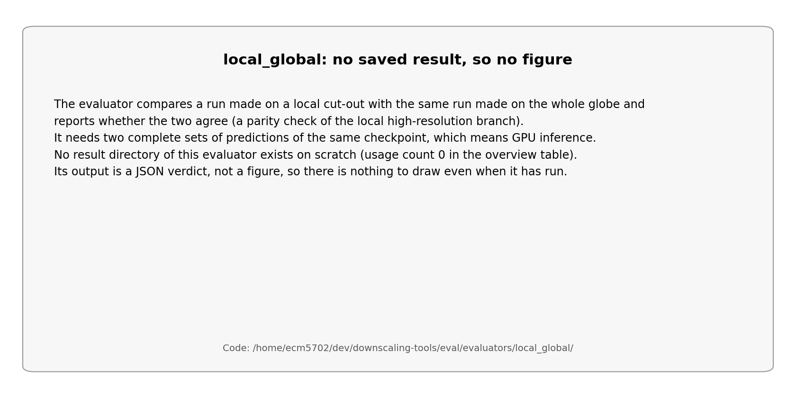
Figure caption: No figure exists, so the image only says so. This evaluator compares a run made on a local cut-out with the same run made on the whole globe, which needs two complete sets of predictions of one checkpoint and therefore GPU inference, and no result directory of it was found on scratch. Its output is a JSON verdict and not a figure; the code is in `/home/ecm5702/dev/downscaling-tools/eval/evaluators/local_global/`.

### 3.4.10 `lane_diagnostics`

**Question it answers.** Which figures explain a result that has already been scored on the o1280 to o2560 lane, with the support, the sample size and the arm stated for every number?

**Method.** It assembles a bundle of about fourteen figures with captions from four small reductions that touch prediction files (`run`, `eval/evaluators/lane_diagnostics/compute.py`) and from artefacts named in the lane configuration (`plot`, `runner.py:144`). The reductions are: the maximum 10 m wind inside a fixed box per (date, lead, member) for the target, the interpolated driver and the model (`box_wind`); how the squared error of precipitation is distributed over rain intensity (`loss_budget`); how close the interpolated input is to the target on two lanes (`pair_coherence`); and the per-member precipitation maximum for each sampler arm (`sampler_peaks`). The other inputs are two "capacity" files made by an earlier session, the precipitation scores file, and a scan of 1,333 paired samples relayed from Jupiter. The box is hard-coded (15 to 40 N, 80 to 35 W, `figures.py:33`), the arms are named in the configuration (control and mass-only autoguidance with weight 1.3), and the standing set of cyclone distribution figures assumes the Humberto campaign of 26 to 30 September 2025. The `stages` option of `evaluate` selects which reductions run.

**Inputs and outputs.** Inputs: the lane block `lane_diagnostics` of `eval/config/lanes/o1280_o2560_humberto6h_pristine.yaml` (capacity files, `precip_scores_json`, `scan_jsonl`, `pair_lanes`, `sampler_arms`). Outputs: `measurements/*.json`, `plots/*.pdf` per figure, a combined PDF, `CAPTIONS.md` and `manifest.json`. Its `score()` returns a dictionary with `scoreboard: False`, not scoreboard records.

**How to run it.**

```
python -m eval.cli evaluate --lane o1280_o2560_humberto6h_pristine --host atos_ac \
    --predictions-dir <run>/predictions --only lane_diagnostics
```

**Cost and constraints.** It runs on CPUs and I did not measure its run time. As configured it cannot run in full: one of its inputs, `precip_scores_json`, points to `/home/ecm5702/scratch/eval/o2560_humberto_pristine_fixed_20260822T082649Z/data/evaluators/precip_scores/scores.json`, which has been cleaned from scratch, and two others point into `/home/ecm5702/agent-work/`.

**How to read the result.** Each figure's caption states its support. It is an explanatory report for one campaign, not a measurement.

**Overlaps.** It consumes `precip_scores` output and repeats parts of `tc` and `spectra_coherence` in its own figures.

**Keep, merge or retire?** My recommendation is to retire it, and to keep the bundle as an archived script with its campaign. It is a report generator for one campaign (hard-coded box, arms and dates), it has no result directory, and it depends on files that are gone or live outside the framework.

**Figure.**
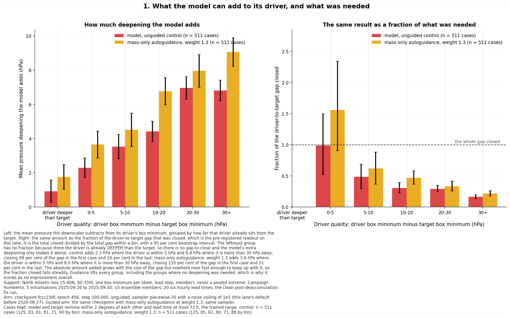
Figure caption: This is the first figure of the lane diagnostics set: the left panel shows the mean pressure deepening (in hPa) that the model adds to its driving forecast, grouped by how much deeper the target storm is than the driver, and the right panel shows the same result as the fraction of the driver-to-target gap that was closed (the axis now follows the data, so the tallest bar, 155 per cent for mass-only autoguidance where the driver is within 5 hPa, is drawn in full with its error bar). Two arms are compared, the unguided control (red) and mass-only autoguidance with weight 1.3 (orange), each with 511 cases from Hurricane Humberto (five start dates, 26 to 30 September 2025, ten members) in a North Atlantic box. The measurements are copied from `/home/ecm5702/agent-work/20260901-o2560-figures/outputs/evaluators/lane_diagnostics/measurements` (archive `/home/ecm5702/perm/eval-archive/o2560_humberto_pristine_fixed_20260822T082649Z`), drawn by the evaluator at commit d46d457 of the branch style/figure-polish-20260929 into `/home/ecm5702/scratch/eval/_figure_polish_20260929/lane_diagnostics/after/plots/`.

### 3.4.11 `mlflow`

**Question it answers.** How did the training and validation losses evolve while this checkpoint was trained?

**Method.** It runs the script `_import.py` as a subprocess with the checkpoint path. The script takes the 32-character run identifier from the checkpoint's parent directory name, reads the embedded `anemoi.json` to find where the model was trained, locates the MLflow file store on Atos (experiment 909682684414341917) or in the local mirror of the Jupiter experiment, copying it from Jupiter with `rsync` over an existing `ssh jupiter` connection when necessary (`eval/evaluators/mlflow/_import.py:41-50`, `:115-125`), merges parent and resumed child runs, and draws the training and validation curves (`_plot_loss.py`, `_plot.py`: key variables, overview with learning rate, and all variables). It treats exit code 2 (no logs found) as acceptable and warns only for other non-zero exit codes (`runner.py:24-59`). It computes no score.

**Inputs and outputs.** Input: a checkpoint path (`--checkpoint`), whose parent folder must be the 32-character run identifier. Output: `evaluators/mlflow/data/mlflow/...` with plots and stored metrics.

**How to run it.**

```
python -m eval.cli evaluate --lane o320_o1280 --host atos_ac \
    --predictions-dir <run>/predictions --checkpoint <ckpt> --only mlflow
```

**Cost and constraints.** It runs on CPUs and I expect seconds to minutes. If the run was trained on Jupiter it needs a live `ssh jupiter` connection on the host where it runs; the project rule is to reach Jupiter only through the node `ac6-100`, which keeps the connection open, so the check `ssh -O check jupiter` in the script will fail on any other node.

**How to read the result.** The project's evaluation rules say that the training and validation loss never judges a run: the monitored loss is dominated by a high-noise floor and ranks runs backwards across validation windows. The curves show training health (divergence, plateaus, resume points), not skill. Two result directories exist.

**Overlaps.** `ladder loss` puts MLflow series into a ladder card with a cross-run overlay; `sigma_loss` recomputes the loss at fixed noise levels.

**Keep, merge or retire?** My recommendation is to retire it as an evaluator and to keep `ladder loss` for the same job. It does not produce evidence, it has two uses, and its Jupiter copy step conflicts with the standing rule about where `ssh jupiter` may be run.

**Figure.**
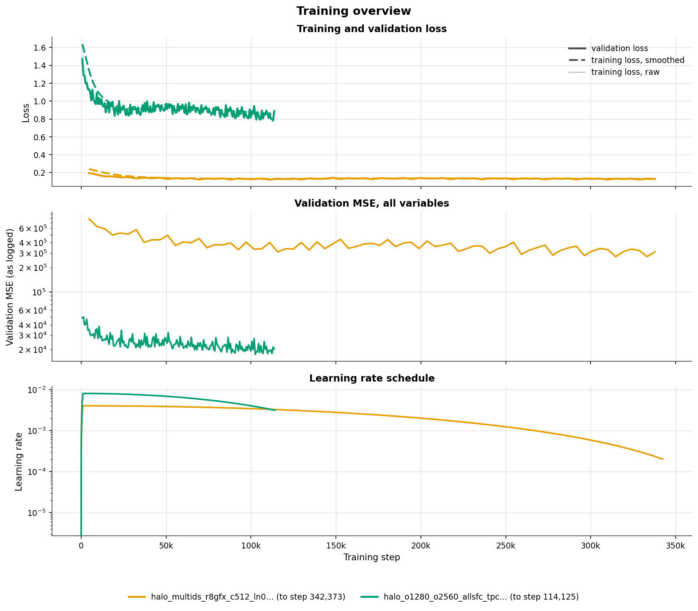
Figure caption: The three panels show, against training step, the training and validation loss (raw and smoothed), the validation mean squared error of all variables (logarithmic axis) and the learning rate schedule of two training runs from the MLflow archive (MLflow is the experiment-tracking tool): `halo_multids_r8gfx_c512_ln0_s3p5_400k` in orange, trained to step 342,373, and `halo_o1280_o2560_allsfc_tpcp_c512_8n_200k` in green, trained to step 114,125. The data come from `/home/ecm5702/perm/mlflow-archive/865455718239814337`, keeping the runs with at least 20,000 steps and `halo` in the name, and were drawn at commit c7e1ccf into `/home/ecm5702/scratch/eval/_repertoire_gallery_20260929/mlflow/`. The two runs solve different problems, so only the shape of each curve is comparable and not the levels.

### 3.4.12 `quaver`

**Question it answers.** How does the ensemble published to the FDB score in ECMWF's quaver scorecard, which is the canonical probabilistic verdict?

**Method.** The evaluator does nothing for a run without an FDB expver: it writes `skipped.json` and returns (`eval/evaluators/quaver/runner.py:311`). Otherwise it reads the window (expver, dates, members, lead times, grid) from the run's `effective_config.json`, and starts the backend script `q_compute_probabilistic.py` under the `quaver` binary (`module load quaver`, `runner.py:278-281`). Quaver then verifies the ensemble, member by member and as an ensemble, with these references (`eval/evaluators/quaver/core/q_compute_probabilistic.py`):

- at the surface, against SYNOP surface observations (station reports) with orography correction, for `2t`, `10ff` and `2d`, using station-density spatial weights, with the scores RMSE of the mean (`rmsef`), fair CRPS, CRPS and spread, over the domains `n.hem`, `tropics`, `s.hem`, `europe` (`:81`, `:174`);
- in the upper air, against the operational analysis (`od`, expver 0001), for `t`, `z`, `u`, `v` at 1000, 850 and 500 hPa, on a 1.5 degree grid and truncation 120, with RMSE, correlation (`ccaf`), standard deviation (`sdaf`), CRPS, fair CRPS and spread (`:83`, `:103-105`).

Lead times run from the first prediction step to the length of the real forecast in the prepml configuration, capped at 240 hours unless the lane overrides it (owner decision of 24 August 2026, `runner.py:42`). By standing rule every scorecard shows three curves: the input (the coarse operational ensemble that drove the model), the model, and a reference (the operational ENFO at the model's output grid). The input and the reference are scored once per window and grid, from MARS, and cached (`resolve_reference_params`, `:186`). The plot phase patches the backend plotting templates and runs them under `quaver` to make the scorecard PDFs. Its `score()` always returns an empty list (`eval/evaluators/quaver/scorer.py:19`), so nothing reaches `scores.csv` from `eval.cli`, although the registry text says it reaches the scoreboard "through its own ingest".

**Inputs and outputs.** Input: an expver already in the FDB and the run's `effective_config.json` (so it must be run with `--expver`, or the run must have been made in prepml mode). Output in `evaluators/quaver/`: `compute.done`, `params.json`, `input_params.json`, `reference_params.json`, scorecard PDFs. Scores are stored in quaver's own database.

**How to run it.**

```
python -m eval.cli evaluate --lane o320_o1280 --host atos_ac \
    --predictions-dir <run>/predictions --expver <expver> --only quaver
```

**Cost and constraints.** It runs on AC only (it needs the FDB, MARS and the `quaver` module). I measured 3 hours 18 minutes on 4 CPUs and 32 GB for a five-date window (job `armA25k-5d-quaver`). A code comment puts the input baseline's MARS queries at about 47 minutes, paid once per window and grid; the reference baseline is computed the same way. A trap for later: the baseline cache defaults to `~/perm/eval/_quaver_input_baseline_cache`, but `/home/ecm5702/perm/eval` is a symbolic link to `/home/ecm5702/scratch/eval/perm_eval_legacy_20260626`, so the cache lives on scratch and can be cleaned (the lane comment says "NEVER ~/perm/eval (scratch symlink)").

**How to read the result.** Lower CRPS is better, and a good model's CRPS should be below its input's and close to the reference's; spread near the ensemble-mean error indicates calibration. Compare only quaver with quaver. Thirty-five result directories exist, for example `/home/ecm5702/scratch/eval/o320_o1280/quaver_jaj3_sept0112/evaluators/quaver` (expver `jaj3`, 1 to 12 September 2025, 10 members, leads 24 to 240 hours, `compute.done` present).

**Overlaps.** `probabilistic` gives CRPS and spread on gridded fields against one ENFO member; quaver gives them against stations and analyses. The retired `obs_crps` was a cheap stand-in for quaver.

**Keep, merge or retire?** My recommendation is to keep it, because it is the reference verdict. Fix the registry sentence about the scoreboard, and move the baseline cache off the scratch symbolic link.

**Figure.**
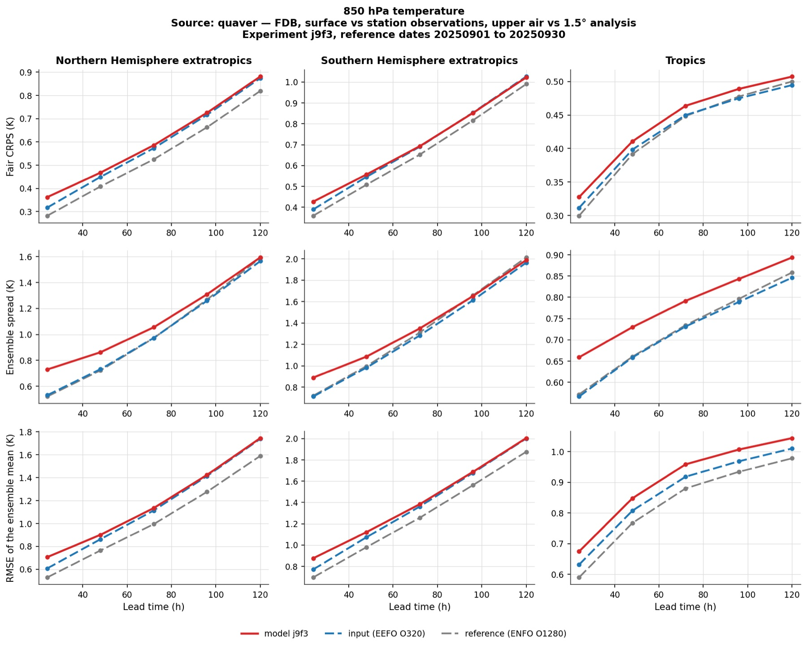
Figure caption: These curves come from quaver, the ECMWF verification tool, for 850 hPa temperature: fair CRPS, ensemble spread and RMSE of the ensemble mean against lead time for three regions, scored against the 1.5 degree analysis, for the model ensemble j9f3 (red), the input EEFO (blue dashed) and the reference ENFO on O1280 (grey dashed), over the reference dates 1 to 30 September 2025. At short lead times the model's spread is larger than that of the input and the reference and its error is above the input's, and the differences shrink with lead time. The curves were stored from the run `/home/ecm5702/scratch/eval/o320_o1280/quaver_sept_full_j9f3_batch/evaluators/quaver` (dumps in `/home/ecm5702/scratch/eval/_plotstyle_check_20260928/quaver_probe/`) and redrawn with the current code into `/home/ecm5702/scratch/eval/_repertoire_gallery_20260929/quaver/`.

### 3.4.13 `storm_maps`

**Question it answers.** What does the deepest storm look like in the truth, the model and the input, and how does its regional power spectrum compare in the 40 to 150 km band?

**Method.** On the prediction files for lead step 072 (the file names ending `step072.nc`; if there are none it uses all files) (`eval/evaluators/storm_maps/runner.py:53`), it takes the native grid points in a box, resamples them by nearest neighbour onto a regular mesh of 0.075 degree with a 2 degree rim removed, removes a linear plane, applies a two-dimensional Hann window, and takes the FFT power (`eval/evaluators/storm_maps/core/render.py:29`, `:71`). Power is binned isotropically into 40 logarithmically spaced wavenumber bins, computed per member and averaged over members, dates and files (the ensemble mean is never used). The fine-band ratio is the sum of the model's power over wavelengths of 40 to 150 km divided by the truth's (`:96-101`), and the slope is a log-log fit over the same band. The fields are `10u`, `10v` and `msl`; truth is each member's `y`, the input is `x_interp`. The deepest storm instance is the member and file with the lowest truth MSLP inside the storm box; the map figure shows 10 m wind and MSLP for truth, model and input around that centre with one colour scale per row. The band was moved on 13 July 2026 from 20 to 100 km to 40 to 150 km because the old band reached 1.2 times the Nyquist wavelength (16.7 km) and integrated a grid-scale noise floor that a multi-GPU runtime inflated by 3.5 to 4.2 times (code comment at `render.py:99`); results computed before that date carry the old band's label, for example `fine_band_20_100km_ratio_to_truth` in `/home/ecm5702/scratch/eval/ladder/zx2seed44_o96_o320/step_0200000/evaluators/storm_maps/storm_maps_spectra.json`.

One caveat: through `eval.cli` the box is not configurable. The evaluator uses an event box of 5 to 35 N, 100 to 40 W and a storm box of 10 to 35 N, 100 to 80 W by default, and reads only the optional `tc.storm_box` or `tc.box` keys of the lane (`runner.py:16-33`); on a lane outside the Atlantic it would measure the wrong region. The step cannot be set from the command line either.

**Inputs and outputs.** Input: prediction files. Output: `storm_maps.png`, `full_spectra.png`, `storm_maps_spectra.json` (fine-band ratio, slope, minimum MSLP in the storm box).

**How to run it.**

```
python -m eval.cli evaluate --lane o320_o1280 --host atos_ac \
    --predictions-dir <run>/predictions --only storm_maps
```

**Cost and constraints.** It runs on CPUs; I measured 2 to 3 minutes on 8 CPUs and 128 GB (jobs `armA25k-stormmaps`, `armA100k-stormmaps`). The ladder calls its backend directly. The project's rules require scoring all arms in the same runtime, because a mixed runtime moves the fine band by a factor of 3.5 to 4.

**How to read the result.** A fine-band ratio near 1 means the model's regional power at 40 to 150 km matches the truth's, and a slope near the truth's means the shape of the spectrum matches. Example from the ladder file above (old band, 20 to 100 km): ratios 1.205 (`10u`), 1.274 (`10v`), 1.093 (`msl`) and slopes of minus 2.52 (model) against minus 2.44 (truth) for `10u`, with the input at minus 0.43.

**Overlaps.** `spectra_ecmwf_v2` is global and uses a true spectral transform; `storm_maps` is regional, uses a box FFT and is comparable only within itself (the code says its numbers are not comparable with global HEALPix boards).

**Keep, merge or retire?** My recommendation is to keep it, because it has been used 63 times and the ladder depends on it. Make the boxes configurable from the `tc` block or the event files so it works on lanes other than the Atlantic.

**Figure.**
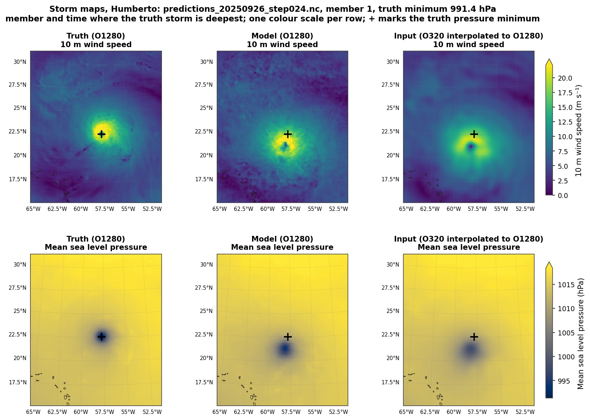
Figure caption: The top row shows 10 m wind speed and the bottom row mean sea level pressure of Hurricane Humberto in the truth (ENFO on O1280), the model and the input (EEFO on O320 interpolated to O1280), each row on one colour scale, with a plus sign at the truth pressure minimum (991.4 hPa); it is member 1 of the file `/home/ecm5702/scratch/eval/o320_o1280/se_F/predictions/predictions_20250926_step024.nc` (start 26 September 2025, lead time 24 hours). The model draws a compact eye, but its pressure minimum lies about one degree south of the truth's, as the input's does, and member 1 of the model is not paired with member 1 of ENFO. The figure was made by calling the evaluator's drawing function directly with a box set by hand (15 to 35 degrees north, 80 to 50 degrees west) into `/home/ecm5702/scratch/eval/_repertoire_gallery_20260929/storm_maps_humberto/`, because the evaluator's own box was not used.

### 3.4.14 `shape`

**Question it answers.** Are the model's fine-scale 10 m wind structures shaped like the truth's, in elongation, aspect ratio and orientation relative to the flow?

**Method.** This is a port (dated 23 September 2026) of two probe scripts of 16 and 17 September 2026 (`eval/evaluators/shape/instrument.py` and `fullrung.py`, with the source md5 sums recorded in their headers). Inside a fixed box (10 to 40 N, 100 to 58 W; `fullrung.py:75`) on the native O1280 points, for each member k it forms the residual of the model draw `d_k = (y_pred_k - x_interp_k)/sd` and of the truth `r_k = (y_k - x_interp_k)/sd`, plus the driver itself, with the training standard deviation `sd`. Each field is band-passed with a seven-Gaussian ladder into two bands: `mid` (about 40 to 109 km) and `b12` (about 21 to 40 km) (`instrument.py:72`, `:81`). Three statistics are measured: the flow-relative anisotropy index A, the variance of the gradient along the local wind divided by the variance across it; the shape of the two-point correlation ellipse in 4 by 4 degree open-ocean windows (`ell_ratio_median`, the median major to minor axis ratio); and the morphology of the connected regions above the field's own 90th percentile (`elong_frac_gt3`, the fraction of regions whose elongation exceeds 3) (`instrument.py:83-87`, `:484-498`). The wind direction comes from each member's own input. The evaluator adds what the original lacked: pooled means over dates and members with a date-clustered bootstrap error (whole dates are resampled, members of a date kept together) (`runner.py:72`). Two arms can be differenced with `python -m eval.evaluators.shape.paired`.

**Inputs and outputs.** Input: global prediction files with 10 members and their own inputs, for steps 24 and 120 by default. Output: per-member CSV parts, `summary.json`, and `metrics.json` with `shape_<statistic>_<field>_<band>_<variable>_s<step>_<window>` and `_se` records (`scorer.py`), where the window is `humberto` (September 2025) or `idalia` (August 2023).

**How to run it.**

```
python -m eval.cli evaluate --lane o320_o1280 --host atos_ac \
    --predictions-dir <run>/predictions --only shape
```

**Cost and constraints.** It runs on CPUs. I measured 35 to 45 minutes on 8 to 16 CPUs (jobs named `shape_*`, which ran the earlier scripts and the port). It depends on files outside the framework: a probe prediction file that defines the box (`/home/ecm5702/agent-work/20260915-matched-feature-draws/outputs/R47k/seed_2026091600/predictions/predictions_20230829_step024.nc`, `fullrung.py:52`), the neighbour cache `/home/ecm5702/scratch/agent-work/20260901-sigma-scale-map/o1280_knn128.npz` (6.8 GB, on scratch, `instrument.py:65`), and cache files under `/home/ecm5702/agent-work/`. The paths can be overridden with `geom_cache`, `mask_cache`, `probe_file` and `stats_file`. All exist today.

**How to read the result.** Compare model and truth for the same band, using the date-clustered standard error as the yardstick; the design note is `docs/epics/fine-scale-o320-o1280/in-progress/20260923_physical_realism_scores.md`. Every prior number came from the earlier scripts; no evaluator result directory exists yet, so no value can be quoted.

**Overlaps.** `texture` measures statistics of the fine part without a notion of flow direction; `wind_extremes` looks at maxima.

**Keep, merge or retire?** I have no firm recommendation; this needs your decision. Keep it only if the shape question is still open, and in that case move the three cache files and the probe file into a stable location such as `/home/ecm5702/hpcperm/data/static/`, because a cleaned scratch file would break it silently.

**Figure.**
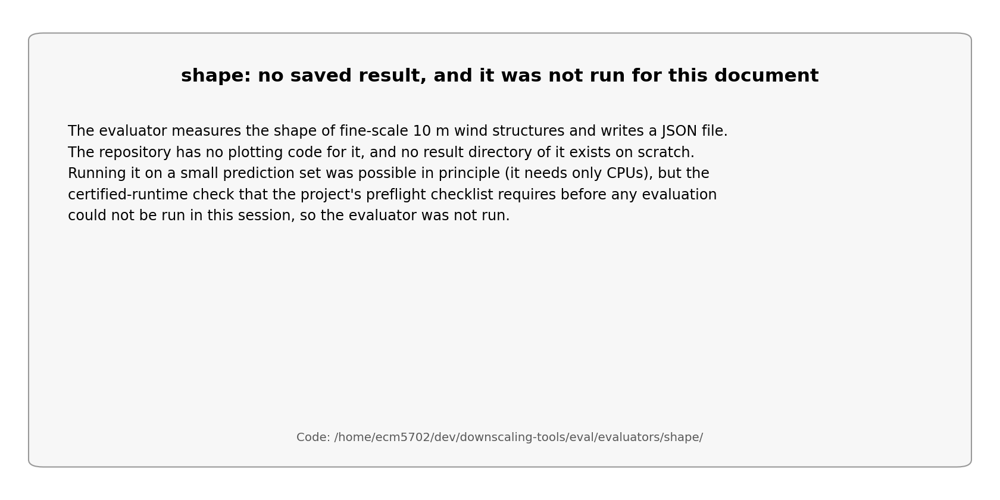
Figure caption: No figure exists, so the image only says so. The evaluator measures the shape of fine-scale 10 m wind structures and writes a JSON file; the repository has no plotting code for it and no saved result was found on scratch. It needs only CPUs, but the certified-runtime check that the project's preflight checklist requires before any evaluation could not be run in this session, so the evaluator was not run; the code is in `/home/ecm5702/dev/downscaling-tools/eval/evaluators/shape/`.

### 3.4.15 `tc_structure`

**Question it answers.** Does the model's tropical cyclone have the truth's structure: centre, central pressure, wind profile, radius of maximum wind, wind radii, vorticity and asymmetry?

**Method.** For every prediction file and every scoring-eligible event whose dates match (`eval/evaluators/tc/core/events.py:70`), the evaluator measures the storm in three fields on the same native grid points: the model, the truth and the input (`eval/evaluators/tc_structure/runner.py:64`). Because member k of the truth is not the storm that member k of the model should reproduce, the three are treated as three ensembles compared through means and spreads, never member against member. A first guess that keeps every centre search on the right storm is the minimum of the truth's ensemble-mean MSLP inside the event box. It is followed along the leads of each initial date: at later leads the first guess is the truth's ensemble-mean low within 900 km per 24 hours of the previous one. A (date, lead) is a "storm case" only if that first guess is a closed low at least 50 km from the box edge with central pressure at most 1005 hPa; once the track is lost, later leads of that date are not storm cases. The measurements (`eval/evaluators/tc_structure/core.py`) are:

- the centre: the minimum of MSLP, refined as a pressure-weighted centroid of points within 1 hPa of the minimum and within 100 km of it (`find_centre`, `:131`);
- the central pressure: the value at the grid minimum (deliberately equal to what `tc` reads);
- the tangential wind profile: the 10 m wind split into radial and tangential parts with respect to the centre and averaged in 10 km radial bins out to 500 km, keeping a bin only if it holds at least half the points that an annulus of that area should hold at the nominal O1280 density (`StructureParams`, `:52`, `O1280_NPOINTS` at `:45`);
- the radius of maximum wind and the azimuthal-mean maximum tangential wind, from a parabola through the maximum bin and its neighbours, plus the plain maximum 10 m wind within 300 km;
- the wind radii R34 and R50, the outermost radii where the profile reaches 17.5 and 25.7 m/s (missing values are NaN, not zero);
- the mean relative vorticity inside 50, 100 and 200 km from the circulation, `2 Vt(r) / r`;
- the asymmetry, the amplitude of the wavenumber-1 Fourier component of wind speed on the ring at the radius of maximum wind, divided by the ring mean;
- the wind-pressure relation per field.

Means over members and valid times, with date-clustered bootstrap errors, are given per lead band (24, 48, 72, 96, 120, 24 to 48, 96 to 120, all) and the differences input minus truth, model minus truth and model minus input.

**Inputs and outputs.** Input: prediction files with `10u`, `10v`, `msl`. Output: `cases.csv`, `profiles.npz`, `summary.json`, `run_meta.json`, and `metrics.json` with `tcs_<event>_<score>_<field>_<band>` and `_se` records for the bands 24-48, 96-120 and all, plus `tcs_<event>_windpressure_{slope,scatter}_<field>_<band>` (`scorer.py`).

**How to run it.**

```
python -m eval.cli evaluate --lane o320_o1280 --host atos_ac \
    --predictions-dir <run>/predictions --only tc_structure
```

**Cost and constraints.** It runs on CPUs, and I did not measure the evaluator itself. The cell area in the coverage rule is that of the O1280 grid, so other output grids need the parameters changed.

**How to read the result.** Compare the model's radius of maximum wind, wind radii and vorticity with the truth's and the input's; a model that reaches the truth's central pressure but has a wider radius of maximum wind has a shallower, broader storm. There is no result directory yet (the design note is `docs/epics/fine-scale-o320-o1280/in-progress/20260923_physical_realism_scores.md`).

**Overlaps.** `tc` reads raw extremes on the same storms; `tctracker` and `tccompare` follow storms in FDB data; `wind_extremes` looks at the maximum wind only; `displacement` reports centre displacement in a different way.

**Keep, merge or retire?** My recommendation is to keep it. It answers questions (radius, radii, vorticity, asymmetry) that no other tool measures, and it feeds directly on the project's main problem. Run it once on the current best runs to see whether its numbers move between arms before deciding whether it earns a place in the routine list.

**Figure.**
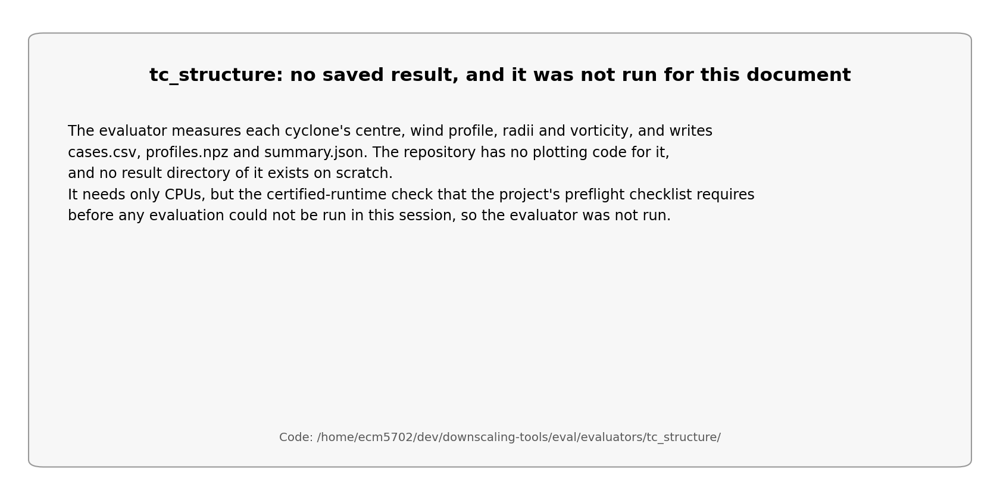
Figure caption: No figure exists, so the image only says so. The evaluator measures each cyclone's centre, wind profile, radii and vorticity and writes `cases.csv`, `profiles.npz` and `summary.json`; the repository has no plotting code for it and no saved result was found on scratch. It needs only CPUs, but the certified-runtime check that the project's preflight checklist requires before any evaluation could not be run in this session, so the evaluator was not run; the code is in `/home/ecm5702/dev/downscaling-tools/eval/evaluators/tc_structure/`.


## 4. Retired tools

Eight evaluators were retired on 28 September 2026. Their code is kept, but cannot be imported, under `/home/ecm5702/dev/downscaling-tools/eval/_quarantine/20260928/<name>/` (the file `eval/_quarantine/20260928/README.md` lists them). Naming a retired evaluator with `--only` prints its replacement and exits with status 1, and a retired name left in a lane's evaluator group is skipped with a warning (`eval/evaluators/registry.py:281`, `eval/cli.py:556`). The registry reason is recorded only as the replacement; where I found a measured reason, I give it.

**`spectra`.** It estimated the power spectrum of each field with a fast proxy: the field was binned onto a HEALPix map and transformed with a calibrated approximation (the backend `eval/tools/spectra_analysis` still holds the calibration scripts). It produced the scoreboard rows named `spectra_<variable>_relative_l2` and `spectra_<variable>_score`, and compared the model with the truth above wavenumber 100. It was retired because `spectra_ecmwf_v2` computes the same comparison with the real ECMWF transform, and the scorer of the replacement says that the two instruments give different numbers for the same run. Replacement: `spectra_ecmwf_v2` (rows `spectra_v2_*`). Code: `eval/_quarantine/20260928/spectra/`. Its `relative_l2` and `spectra_score` functions were kept in `eval/evaluators/spectra_ecmwf_v2/core/scoreboard.py`, where the replacement uses them. Cards and scoreboard records made before the retirement still carry the old rows.

**`spectra_ecmwf`.** Version one of the ECMWF-transform spectra. It staged fields onto template GRIB files from which 28 latitude rows near the poles had been removed. On 25 August 2026 that mask was measured, on a real O1280 field at a fixed truncation, to shift the spectrum by 2.0 per cent at the median and 13.2 per cent at worst inside the scored band (docstring of `spectra_ecmwf_v2/__init__.py`). It also read amplitudes through Metview. Replacement: `spectra_ecmwf_v2`, which stages onto the complete grid and reads amplitudes with eccodes (agreeing with the Metview values to about 5e-12). Code: `eval/_quarantine/20260928/spectra_ecmwf/`.

**`sigma`.** An older per-noise-level loss sweep computed by a separate script. Replaced by `sigma_loss`, which does the same job inside the evaluator interface. Code: `eval/_quarantine/20260928/sigma/`; the backend `eval/tools/sigma_evaluator` stays in place because other code still needs it.

**`obs_crps`.** The fair CRPS of the published ensemble against surface station observations, as a cheap surface-only stand-in for quaver. Replaced by `quaver`, which is the canonical scorecard and also covers the upper air. Code: `eval/_quarantine/20260928/obs_crps/`; the backend `eval/tools/obs_crps` stays because `tools/station_head` uses it.

**`mechanistic`.** A stub that only created empty output directories; it never analysed weights. No replacement. Code: `eval/_quarantine/20260928/mechanistic/`. The real weight-diagnostics code lives in `eval/tools/weight_diagnostics` and is untouched.

**`interp`.** A renderer for interpretability PDFs that were computed outside the command line. No replacement; the top-level package `interp` (with `interp.viz`) still exists. Code: `eval/_quarantine/20260928/interp/`.

**`leadtime`.** Per-lead-time surface scores and spectra. `eval/README.md` says it was complete but never wired in or validated; the registry says it was never registered and never ran. No replacement. Code: `eval/_quarantine/20260928/leadtime/` and its backend.

**`intermediate`.** Plots of the intermediate steps of the diffusion sampler. No replacement. Code: `eval/_quarantine/20260928/intermediate/`; the backend `eval/tools/plot_intermediate` stays in place.

The same quarantine folder also holds dead job scripts and archived templates (`jobs/autopilot*.py`, `jobs/codex_eval*`, `jobs/generate_clean_scoreboards.py`, `jobs/generate_enfo_o320_scoreboard.py`, and others listed in its README).

## 5. Known documentation errors

These are places where the documentation, or a comment, says something that the code contradicts, or refers to something that no longer exists. Each item names the file and the line.

1. **Percentile names of the TC extremes.** The evaluation skill says the TC verdict uses "MSLP p0.1 / wind p99.9" (`/home/ecm5702/dev/docs/skills/downscaling-evaluation/SKILL.md:32`), and the probe recipes say the same (`references/probe-recipes.md:71`, and `:79` for the ladder "p50 to p0.1 to min"). The code computes the 0.01th percentile of MSLP and the 99.99th percentile of wind: `eval/evaluators/tc/core/stats.py:210` (`np.percentile(msl, 0.01)`) and `:215` (`np.percentile(wind, 99.99)`). The keys `mslp_p01` (0.1th percentile) and `wind_p999` (99.9th) exist in `stats.json` (`stats.py:209`, `:214`) but are not emitted to the scoreboard. The same mislabelling appears in code comments: `eval/evaluators/tc/scorer.py:8`, `eval/evaluators/tc/core/scoreboard.py:8` and `:43` ("mslp_p001 = 0.1th percentile MSLP; wind_p9999 = 99.9th percentile").
2. **TC ratio metrics that no longer exist.** `eval/README.md:132-146` documents four ratio metrics per event (`tc_<event>_mslp_p001_ratio` and so on) and aggregates anchored to the analysis. `score()` emits only raw extremes (`eval/evaluators/tc/scorer.py:6-11` says so, and `:25-30` lists them), and the evaluation skill says ratios are retired. The comment at `eval/config/lanes/o96_o320.yaml:23-26` repeats the README's claim.
3. **The group "standard" does not match the lane files.** The registry defines "standard" as runs by default on a lane (`eval/evaluators/registry.py:12`). Only `region_plot` is in the default group of the four canonical lanes (`evaluator_groups.default` is `[tc, spectra_ecmwf_v2, surface, region_plot]` in `o48_o96.yaml`, `o96_o320.yaml`, `o320_o1280.yaml` and `o1280_o2560.yaml`); `probabilistic` is not.
4. **`sigma_loss` is "scored" in the registry and "diagnostics-only" everywhere else.** `registry.py:97-101` marks it scored and feeding the scoreboard; its own docstring says "Diagnostics-only; not run by default" (`eval/evaluators/sigma_loss/__init__.py:5`); the lane files put it in the `diagnostics` group, except `o48_o96_fastlane.yaml:191`.
5. **`quaver` and the scoreboard.** The registry says quaver "reaches the scoreboard through its own ingest" (`registry.py:169-174`), but nothing in this repository ingests it, and its `score()` returns an empty list (`eval/evaluators/quaver/scorer.py:19`). The README of its backend says it is "not part of the `python -m eval.cli evaluate` framework" and that "there is no evaluator wrapper" (`eval/evaluators/quaver/core/README.md:3`, `:14`), although the wrapper exists and `eval.cli` adds it automatically when `--expver` is given (`eval/cli.py:537`).
6. **The launcher `launch_full_eval_suite.sh` is described as living in `eval/jobs/` and "still working".** It now exists only at `eval/archive/jobs/launch_full_eval_suite.sh`. The wrong path is used at `eval/evaluators/quaver/core/README.md:3` and `:25`, `eval/FULL_SUITE_PLAYBOOK.md:48` and `:54`, and `ARCHITECTURE.md:260`, `:301` and `:307`.
7. **Job names in the playbook.** `eval/FULL_SUITE_PLAYBOOK.md:23` lists `02_eval_spectra.sbatch`; `render_pipeline` names each file after the evaluator, so the file is `02_eval_spectra_ecmwf_v2.sbatch` (`eval/jobs/pipeline.py:221`).
8. **Retired evaluators still listed as present.** `ARCHITECTURE.md:208-210` lists `plots/sigma/`, `plots/mechanistic/` and `plots/intermediate/` as run outputs. The help text of `evaluate --checkpoint` names `mechanistic` as an example (`eval/cli.py:232`), and a comment names `spectra.steps` and `spectra_ecmwf.steps` (`eval/cli.py:1806`). The notebooks `02_intermediate_plots.ipynb`, `04_sigma_evaluator.ipynb` and `06_spectra.ipynb` in `eval/notebooks/` are named for retired evaluators (I did not open them).
9. **Skills that still describe version one of the spectra.** `downscaling-evaluation/references/metrics-as-computed.md:55` describes the spectra evaluator as `eval/evaluators/spectra_ecmwf/` with a Metview amplitude stage; that package is quarantined and version two reads amplitudes with eccodes. `ecmwf-infra-reference/references/cross-hpc-and-glossary.md:54` and `references/streams-expvers-grids.md:39` say metview is used by the `spectra_ecmwf` evaluator (now only regridded `tc` uses metview), and `downscaling-debugging/references/triage-tables.md:37` has a row for a metview error in `spectra_ecmwf`.
10. **Lane keys that nothing reads.** `tc.beta`, `tc.mslp_ref` and `tc.tail_keys` (`o96_o320.yaml:28`, `:29` and `:31`, and equivalents in other lanes) are not read by any code. `surface.weighting` is read at `eval/evaluators/surface/scorer.py:45` and then unused. Canonical lane files still contain blocks for retired evaluators (`spectra:`, `spectra_ecmwf:`, `sigma:` in `o96_o320.yaml`), and several older lanes still list `spectra` and `spectra_ecmwf` in their default group (for example `_hres_shorteval_ac.yaml:153`, `o96_o320_pristine_m1sw2band.yaml:139`, `_p03_*.yaml:152`), which now only produces a warning at run time.
11. **A file that nothing imports.** `eval/evaluators/region_plot/config.py` repeats the default weather-state and panel lists, but the real defaults come from `eval/evaluators/region_plot/core/plotting/config.py:81-82`.
12. **The texture docstring.** `eval/evaluators/texture/runner.py:1` says "native output grid (O1280 or O2560)"; the default matrices and paths (`:141`) are O320 to O1280 only.
13. **Leftover names in `spectra_ecmwf_v2`.** Its error message says "spectra_ecmwf requires gptosp.ser" (`runner.py:114-117`), its default output folder is `evaluators/spectra_ecmwf` (`runner.py:111`), and it reads the lane key `spectra_ecmwf.truncation` in its message. Only cosmetic: `eval.cli` always passes the output folder.
14. **Statements about `ssh jupiter`.** `eval/evaluators/mlflow/_import.py:50` and `:122` call `ssh jupiter` directly. The standing rule is to reach Jupiter only through the node `ac6-100`; the code will work only on the node that holds the open connection.
15. **The quaver baseline cache location.** The cache root defaults to `~/perm/eval/_quaver_input_baseline_cache` (`eval/evaluators/quaver/runner.py:241`, `_input_cache_dir`), but `~/perm/eval` is a symbolic link to scratch (`/home/ecm5702/scratch/eval/perm_eval_legacy_20260626`). The lane comment at `o1280_o2560_humberto6h_pristine.yaml:208` says "NEVER ~/perm/eval (scratch symlink)".

## 6. Open questions for you

Each question is a decision that the review needs. My recommendation is in section 3 under the tool's name; the number in brackets is the section.

1. `report` [3.1.6]: retire it (no `report.html` found anywhere), or keep it?
2. `videogen` [3.1.8]: retire it, or move it out of `eval.cli` into a presentation folder? Its scenes are tied to one old checkpoint.
3. `prepml-cleanup` [3.1.7]: keep it in `eval.cli`, or move it to prepml tooling? And is the ecFlow route or `prepml housekeeping --cleanup-expver` the sanctioned way to delete FDB data?
4. `pipeline` [3.1.15]: is it still used? Two generated launchers exist against a thousand direct runs.
5. `evolution` [3.1.9]: fold it into `ladder` as a subcommand, since it only reads ladder cards?
6. `tctracker` and `tccompare` [3.1.10, 3.1.11]: keep as two subcommands or merge them into one that tracks and then compares?
7. `membermaps` [3.1.12]: make the subcommand the primary tool and turn the evaluator into a thin loop over it?
8. `region_plot`, `membermaps`, `storm_maps`, `precip_events` and the member maps inside `tc` [3.3.1]: five map generators over the same files. Which do you want to keep as separate tools?
9. `tc` [3.2.1]: should the evaluator print the pooled sample size beside each extreme, and should a native-grid support be run beside the 0.25 degree one?
10. `surface` [3.2.2]: stop publishing `surface_weighted_mse` (mixed units), and accept that `surface_weighted_nmse` is 87 per cent wind error in the one example I read?
11. `spectra_ecmwf_v2` [3.2.3]: add sub-band scores so that the finest scales count, and absorb the coherence into this evaluator?
12. `precip_scores`, `precip_dist`, `precip_events` [3.2.4, 3.4.7, 3.4.8]: is six-hour precipitation on the o1280 to o2560 lane still a target? If yes, merge the two diagnostics into `precip_scores`; if no, retire all three.
13. `sigma_loss` [3.2.5]: move it to "diagnostic", or retire it? It is the training loss at fixed noise levels, and your own rule says the loss never judges a run.
14. `probabilistic` [3.3.2]: put it in the default group of the four canonical lanes, so that the registry's definition of "standard" is true?
15. `spread_proxy` [3.4.6]: merge it into `probabilistic`?
16. `texture` [3.4.1]: add it to the `diagnostics` group of `o320_o1280` so that `--include-diagnostics` runs it?
17. `wind_extremes` and `displacement` [3.4.2, 3.4.3]: keep as optional tools, or merge them into one evaluator about where features sit? Both were used only on one case study.
18. `spectra_coherence` [3.4.4]: merge into `spectra_ecmwf_v2`, or keep it separate on the HEALPix transform? Wire in or delete `stratified.py` and `calibration.py`.
19. `local_global` [3.4.9]: turn it into a test, since its reference data are gone and it has never produced a result?
20. `lane_diagnostics` [3.4.10]: retire it and archive the script with its campaign?
21. `mlflow` [3.4.11]: retire it and rely on `ladder loss`?
22. `quaver` [3.4.12]: correct the registry sentence about the scoreboard, and move the input baseline cache off the scratch link?
23. `storm_maps` [3.4.13]: make the boxes and the lead step configurable, so that it works on lanes outside the Atlantic?
24. `shape` [3.4.14]: keep it, and if so, move its cache and probe files from `agent-work` and scratch into a stable place? Or is the shape question closed?
25. `tc_structure` [3.4.15]: keep it and run it once on the current best arms to see whether its numbers separate them?
26. Cross-cutting: who corrects the fifteen documentation items of section 5, and should the correction be part of the `list` and `describe` refactor that is running now?

## 7. Other scripts that sit next to the framework

These are in `eval/jobs/` and are not subcommands; they are listed so that nothing is missed. I read only their opening docstrings.

| Script | What it does |
|---|---|
| `ladder_references.py` | Builds the input and target anchor files (`flat.json`) that `evolution` needs, from the ladder's own predictions, at no forward-pass cost; the ENFO anchor drops member 0 so the truth is not scored against itself |
| `ag_crps_probe.py` | CRPS, spread and ensemble-mean error for autoguidance, with one fixed input and N seeds per arm; uses the square-root-of-mean-variance spread convention |
| `ag59e4_screen.py` | Paired control-versus-autoguidance screen for the older `59e4` class of checkpoints |
| `compare_probabilistic_reference.py`, `export_quaver_probabilistic_reference.py` | Export quaver curves to CSV and compare them with the local `probabilistic` summary |
| `backfill_tc_extreme_percentiles.py` | Adds `mslp_p001` and `wind_p9999` to old TC `stats.json` files |
| `build_tc_o320_o1280_regional_predictions_from_dataloader.py` | Builds regional prediction files from the training dataloader for the regional TC harness |
| `scoreboard_metrics.py`, `scoreboard_surface_loss.py` | Compatibility helpers; the first is marked deprecated but a live template still imports it |


